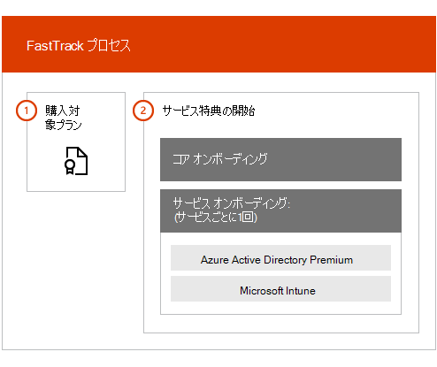

# FastTrack センター特典の概要

Microsoft Azure Active Directory Premium、Microsoft Intune、および Azure Information Protection 向けの FastTrack センター 特典を使用すると、FastTrack スペシャリストとリモートで作業して運用のための環境の準備を進め、組織内でのロールアウトと利用を計画できます。 利用資格の詳細については、「[Enterprise Mobility + Security (EMS) 向け FastTrack センター特典プロセス](EMS-fasttrack-process.md)」を参照してください。

オンボーディングには、次の 2 つの主な構成要素があります。

-   **コア オンボーディング** - テナント構成と Azure Active Directory との統合 (必要な場合) に必要なタスクです。 コア オンボーディングは、Microsoft Online の他の対象サービスのオンボーディングのためのベースラインにもなります。

-   **サービス オンボーディング** - EMS ワークロードのいずれかのスタンドアロンのバリエーション (Azure AD Premium、Intune、および Azure Information Protection) を構成するために必要なタスクです。

次の図では、FastTrack センター特典の高度なオンボーディング フェーズを示します。

プロセスは次のようになります。

- ユーザーが対象サービスのライセンスを購入すると、オンボーディングのサポートを提供するために FastTrack センターがユーザーに連絡を取ります。 組織でサービスを展開する準備ができている場合は、[FastTrack センター](https://go.microsoft.com/fwlink/?linkid=780698)にサポートを依頼することもできます。 サポートをリクエストするには、職場または学校のアカウントを使用して[ FastTrack センター](https://go.microsoft.com/fwlink/?linkid=780698)にサインインし、ダッシュボードに移動し、ページの右下隅にある [**ヘルプが必要ですか?**] リンクを展開し、画面の指示に従ってリクエストを完了します。 オンボーディング サポートの開始後に、オンライン会議をスケジュールいたします。

-   FastTrack チームはまず (すべての Microsoft Online サービスに共通の) コア機能に関するサポートを提供し、次に各対象サービスのオンボーディングをサポートいたします。

すべての導入ガイドは、FastTrack の担当者によりリモートで提供されます。

-   FastTrack チームは、ツール、説明書、およびガイダンスを組み合わせて使用してさまざまなオンボーディング活動でお客様を遠隔からサポートします。

-   オンボーディング ガイドは FastTrack センターにより提供され、各地域の通常業務時間内に入手いただけます。

-   オンボーディングのサポートは、繁体字中国語、簡体字中国語 (担当者は標準中国語のみ使えます)、英語、フランス語、ドイツ語、イタリア語、日本語、韓国語、ポルトガル語 (ブラジル)、スペイン語、タイ語、ベトナム語で利用できます。

-   FastTrack チームはお客様またはお客様の代理者と直接連携して作業いたします。

> [!NOTE]
> **詳細な情報をご希望の場合は**、[Enterprise Mobility + Security](https://www.microsoft.com/cloud-platform/enterprise-mobility) をご覧ください。

## 次の手順

[EMS 向け FastTrack センター特典 - ソース環境要件](EMS-source-environment-expectations.md)

