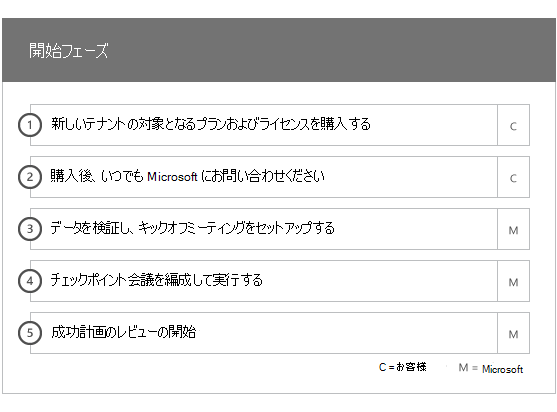
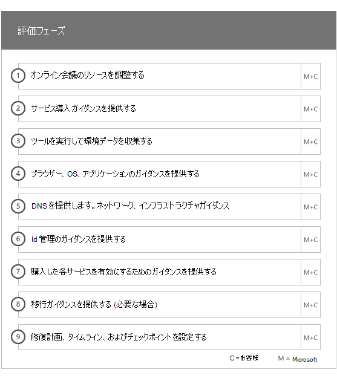
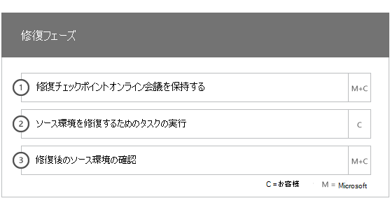
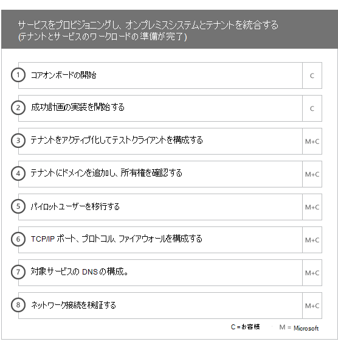
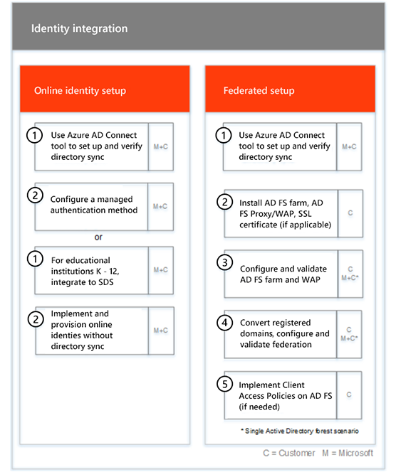
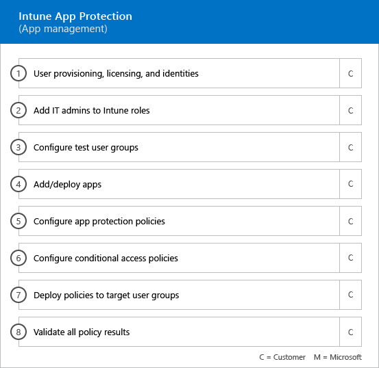
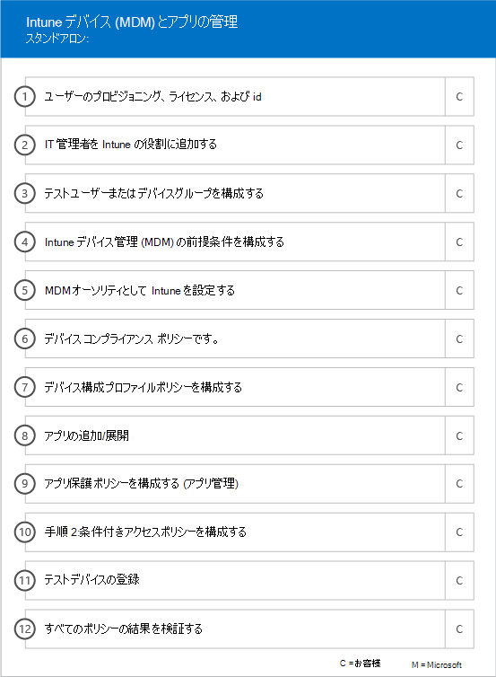
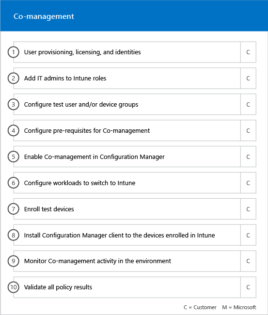

# オンボードフェーズOnboarding Phases

対象となる[サービスおよびプラン](M365-eligible-services-and-plans.md)を使用して microsoft Azure Active Directory Premium と microsoft Intune を使用できるようにする場合、このプロセスにはいくつかのフェーズが含まれます。次のセクションでは、オンボードプロセスの各フェーズについて説明します。When you use the [Eligible Services and Plans](M365-eligible-services-and-plans.md) to get Microsoft Azure Active Directory Premium and Microsoft Intune ready for use, there are several phases involved in the process. The following sections describe each phase of the onboarding process.

オンボードには、4つの主要なフェーズがあります。Onboarding has four primary phases:

## 開始フェーズInitiate phase

適切な数のライセンスを購入した後、購入確認メールのガイダンスに従って、ライセンスを既存のテナントまたは新しいテナントに関連付けます。その後、fasttrack センターの特典の資格が確認され、お客様と連絡して、オンボードのサポートを提供することを試みます。After you purchase the appropriate number of licenses, follow the guidance from the purchase confirmation email to associate the licenses to your existing tenant or new tenant. Microsoft then verifies your eligibility for the FastTrack Center Benefit and tries to contact you to offer onboarding assistance.

> [!NOTE]
> 組織のためにこれらのサービスを展開する準備が整っている場合は、 [fasttrack センター](https://go.microsoft.com/fwlink/?linkid=780698)からサポートを依頼することもできます。You can also request assistance from the [FastTrack Center](https://go.microsoft.com/fwlink/?linkid=780698) if you're ready to deploy these services for your organization.

### アシスタンスを要求するにはTo request assistance

1. [FastTrack サイト](https://go.microsoft.com/fwlink/?linkid=780698)にサインインします。Sign in to the [FastTrack site](https://go.microsoft.com/fwlink/?linkid=780698).
2. **[FastTrack]** を選択します。Select **FastTrack**.
3. **[サービス]** を選択します。Select **Services**.
4. **Microsoft 365 フォームのサポート要求**を完了します。Complete the **Request for Assistance with Microsoft 365 form**.

オンボーディング サポートを開始すると、オンライン会議のスケジュールが決まります。Once onboarding support starts, we’ll set up a schedule of online meetings.

> [!NOTE]
> Office 365 テナントに Microsoft パートナーが登録されている場合、このオプションは表示されません。詳細については、Microsoft パートナーにお問い合わせください。If you have a Microsoft partner listed in your Office 365 tenant, you won't see this option. Please consult your Microsoft partner for assistance.

Microsoft パートナーは、お客様の代わりに[fasttrack サイト](https://go.microsoft.com/fwlink/?linkid=780698)からサポートを受けることもできます。そのためには次のようにします。Microsoft partners can also get help through the [FastTrack site](https://go.microsoft.com/fwlink/?linkid=780698) on behalf of a customer. To do so:

1. [FastTrack サイト](https://go.microsoft.com/fwlink/?linkid=780698)にサインインします。Sign in to the [FastTrack site](https://go.microsoft.com/fwlink/?linkid=780698).
2. **[FastTrack]** を選択します。Select **FastTrack**.
3. **[顧客]** を選択します。Select **My Customers**.
4. 顧客を検索するか、顧客リストから選択します。Search for your customer or select them from your customer list.
5. **[サービス]** を選択します。Select **Services**.
6. **Microsoft 365 フォームのサポート要求**を完了します。Complete the **Request for Assistance with Microsoft 365 form**.

オンボードのサポートが開始されると、fasttrack はオンボードプロセスについて話し、データを検証し、キックオフミーティングを設定するためのオンライン会議のスケジュールを設定します。Once the onboarding support starts, FastTrack sets up a schedule of online meetings with you to discuss the onboarding process, verify data, and set up a kick-off meeting.

## 評価フェーズAssess phase

オンボードプロセスが開始されると、fasttrack センターは、ソース環境と要件を評価するためにお客様と連携します。お客様の環境を評価するためのツールが実行されており、fasttrack スペシャリストは、オンプレミスの Active Directory、インターネットブラウザー、クライアントデバイスのオペレーティングシステム、ドメインネームシステム (DNS)、ネットワーク、インフラストラクチャ、および id システムを評価しています。オンボードの変更が必要かどうかを確認します。Once the onboarding process begins, the FastTrack Center works with you to assess your source environment and the requirements. Tools are run to assess your environment, and FastTrack Specialists guide you through assessing your on-premises Active Directory, Internet browsers, client devices' operating systems, Domain Name System (DNS), network, infrastructure, and identity system to determine if any changes are required for onboarding.

fasttrack センターでは、対象となるサービスの適切な導入を促進する方法についてのガイダンスもご利用ください。The FastTrack Center also connects you with guidance about how to drive successful adoption of the eligible services.

現在の設定に基づいて、移行計画を提供します。これにより、ソース環境にオンボードが EMS または個別のクラウドサービスを正常に完了するための最小要件が設定されます。また、修復フェーズのための適切なチェックポイント呼び出しも設定します。Based on your current setup, we provide a remediation plan that brings your source environment up to the minimum requirements for successful onboarding to EMS or its individual cloud services. We also set up appropriate checkpoint calls for the remediation phase.

## 修復フェーズRemediate phase
移行元環境で修復プランのタスクを実行して、各サービスのオンボードと導入の要件を満たします (必要な場合)。You perform the tasks in the remediation plan on your source environment so that you meet the requirements for onboarding and adopting each service (as needed).

有効化フェーズを開始する前に、修復アクティビティの結果を共同で検証して、続行する準備ができていることを確認してください。Before you begin the Enable phase, we jointly verify the outcomes of the remediation activities to make sure you’re ready to proceed.

## 有効化フェーズEnable phase
すべての修復アクティビティが完了すると、プロジェクトは、サービス利用のためのコアインフラストラクチャの構成、および対象となる EMS クラウドサービスをそれぞれプロビジョニングするために変化します。When all remediation activities are complete, the project shifts to configuring the core infrastructure for service consumption and to provisioning each eligible EMS cloud service.

**フェーズコア機能を有効にする****Enable phase - Core capabilities**

コアオンボードには、サービスのプロビジョニングとテナントと id の統合が含まれます。Azure AD Premium および Intune などのオンボードオンラインサービスの基礎を提供するための手順についても説明します。Core onboarding involves service provisioning and tenant and identity integration. It also includes steps for providing a foundation for onboarding online services such as Azure AD Premium and Intune.

> [!NOTE]
> WAP は、Web アプリケーション プロキシ (Web Application Proxy) を略したものです。SSL は、Secure Sockets Layer を略したものです。SDS は、School Data Sync を略したものです。SDS の詳細については、「[Microsoft School Data Sync へようこそ](https://go.microsoft.com/fwlink/?linkid=871480)」を参照してください。WAP stands for Web Application Proxy. SSL stands for Secure Sockets Layer. SDS stands for School Data Sync. For more information on SDS, see [Welcome to Microsoft School Data Sync](https://go.microsoft.com/fwlink/?linkid=871480).

> [!NOTE]
> 管理された認証方法にはが含まれていますが、パスワードハッシュの同期に限定されません。id の統合は、1回限りのアクティビティであり、管理やフェデレーションなどの既存の認証方法の移行または廃止には含まれません。A managed authentication method includes, but is not limited to password hash synchronization. Identity integration is a one time activity and does not include migrating or decommissioning of existing authentication methods, such as managed or federated.

### 有効化フェーズ-Azure AD PremiumEnable phase - Azure AD Premium

azure AD Premium 環境をセットアップするには、azure Active directory Connect tool ディレクトリ同期と Active Directory フェデレーションサービス (AD FS) を使用します (必要な場合)。The Azure AD Premium environment can be set up by using the Azure Active Directory Connect tool directory synchronization and Active Directory Federation Services (AD FS) (as needed).

オンプレミス id とクラウドの同期を含む Azure AD Premium シナリオでは、サブスクリプションに IT 管理者とユーザーを追加し、管理前提条件を構成し、azure ad Premium を設定し、ディレクトリを設定することによって、お客様を支援します。Azure AD Connect ツールを使用して管理された認証と AD FS を同期し、テストユーザーを構成して、サービスのコアユースケースを検証します。For Azure AD Premium scenarios that include synchronizing on-premises identities to the cloud, we help you by adding IT admins and users to your subscription, configuring management prerequisites, setting up Azure AD Premium, setting up directory synchronization with managed authentication and AD FS using the Azure AD Connect tool, configuring test users, and validating your core use cases for the service.

Azure AD Premium セットアップには、次の機能を有効にすることが含まれます。Azure AD Premium setup includes enabling the following features:

-   Azure Active Directory セルフサービスのパスワードのリセット (SSPR)。Azure Active Directory Self-Service Password Reset (SSPR).

-   azure 多要素認証 (azure MFA)。Azure Multi-Factor Authentication (Azure MFA).

-   [Azure Active Directory Marketplace](https://azure.microsoft.com/marketplace/active-directory/)のシングルサインオン (SSO) を使用したサービス (SaaS) アプリケーションの統合として、最大3つ以上のソフトウェア。Up to three (3) or more Software as a Service (SaaS) application integrations with Single Sign-On (SSO) from the [Azure Active Directory Marketplace](https://azure.microsoft.com/marketplace/active-directory/).

-   [アプリ統合チュートリアルリスト](https://docs.microsoft.com/en-us/azure/active-directory/saas-apps/tutorial-list)に記載されている事前に統合された SaaS アプリケーションの自動ユーザープロビジョニングのみ。送信プロビジョニングのみに制限されます。Automatic user provisioning for pre-integrated SaaS applications as listed in the [App integration tutorial list](https://docs.microsoft.com/en-us/azure/active-directory/saas-apps/tutorial-list), limited to outbound provisioning only.

-   カスタマイズされたログオン画面 (ロゴ、テキスト、画像など)。Customized logon screen, including logo, text, and images.

-   セルフサービスおよび動的グループ (グループ)。Self-Service and Dynamic Groups (Groups).

-   Azure Active Directory アプリケーションプロキシ。Azure Active Directory Application Proxy.

-   Azure Active Directory Connect Health。Azure Active Directory Connect Health.

-   Azure Active Directory の条件付きアクセス。Azure Active Directory Conditional Access.

-   Azure Active Directory の使用条件。Azure Active Directory Terms of Use.

-   Azure Active Directory id 保護。Azure Active Directory Identity Protection.

-   Azure Active Directory の特権 id 管理。Azure Active Directory Privileged Identity Management.

-   Azure Active Directory アクセスレビュー。Azure Active Directory Access Reviews.

### 有効化フェーズ-IntuneEnable phase - Intune

intune では、Microsoft intune を使用してデバイスを管理できるようにするためのガイドを提供しています。正確な手順は、ソース環境によって異なり、モバイルデバイスとモバイルアプリ管理のニーズに基づいています。手順には次のものがあります。For Intune, we guide you through getting ready to use Microsoft Intune to manage devices. The exact steps depend on your source environment and are based on your mobile device and mobile app management needs. The steps can include:

-   エンドユーザーのライセンスを取得します。また、必要に応じて、Microsoft クラウドサービスのテナントのボリュームライセンスをアクティブ化する方法についても説明します。Licensing your end users. We also provide assistance on how to activate volume licenses for your Microsoft cloud service tenant (as needed).

-   オンプレミスの Active Directory またはクラウド id のいずれかを活用して、Intune で使用される id を構成します。Configuring identities to be used by Intune by leveraging either your on-premises Active Directory or cloud identities.

-   Intune サブスクリプションへのユーザーの追加、IT 管理者の役割の定義、およびユーザーとデバイスグループの作成。Adding users to your Intune subscription, defining IT admin roles, and creating user and device groups.

-   管理ニーズに応じて、次のようなモバイルデバイス管理 (MDM) 権限を構成します。Configuring your Mobile Device Management (MDM) authority, based on your management needs, including:

    -   intune が唯一の mdm ソリューションである場合、または Office 365 用のモバイルデバイス管理と連携している場合に、mdm 機関として intune を設定します。Setting Intune as your MDM authority when Intune is your only MDM solution or is in conjunction with Mobile Device Management for Office 365.

-   MDM ガイダンスの提供:Providing MDM guidance for:

    -   MDM 管理ポリシーの検証に使用するテストグループを構成する。Configuring tests groups to be used to validate MDM management policies.

    -   MDM 管理ポリシーおよびサービスの構成は次のように行います。Configuring MDM management policies and services like:

        -   web リンクまたはディープリンクを介して、サポートされている各プラットフォームのアプリケーションを展開します。Application deployment for each supported platform through web links or deep links.

        -   条件付きアクセスポリシー。Conditional access policies.

        -   組織内に既存の証明機関、wi-fi、または vpn インフラストラクチャがある場合、電子メール、ワイヤレスネットワーク、および仮想プライベートネットワーク (vpn) プロファイルを展開します。Deployment of email, wireless networks, and virtual private network (VPN) profiles if you have an existing  certificate authority, Wi-Fi or VPN infrastructure in your organization.

        -   Microsoft Intune Exchange Connector のセットアップ (該当する場合)。Setting up the Microsoft Intune Exchange Connector (when applicable).

        -   Intune データウェアハウスへの接続Connecting to Intune Data Warehouse

        -   Intune との統合:Integrating Intune with:
            -   リモートアシスタンスのチームビューアー (チームビューアーサブスクリプションは必須)。Team Viewer for remote assistance (Team viewer subscription is required).

            -   モバイル脅威防御 (MTD) パートナーソリューション (モバイル脅威防御サブ機能が必要です)。Mobile Threat Defense (MTD) partner solutions (Mobile Threat Defense subcription is required).

            -   通信経費管理ソリューション (通信経費管理ソリューションサブスクリプションは必須)。Telecom expense management solution (Telecom expense management solution subscription is required).

            -   windows Defender Advanced Threat Protection (windows e5 または Microsoft 365 E5 ライセンスが必要です)。Windows Defender Advanced Threat Protection (Windows E5 or Microsoft 365 E5 licenses are required).

    -   [サポートされている各プラットフォーム](https://technet.microsoft.com/library/dn600287.aspx)のデバイスを Intune に登録します。Enrolling devices of each [supported platform](https://technet.microsoft.com/library/dn600287.aspx) to Intune.

-   アプリ保護ガイダンスの提供:Providing App Protection guidance on:

    -   サポートされている各プラットフォームのアプリ保護ポリシーを構成します。Configuring app protection policies for each supported platform.

    -   管理対象アプリの条件付きアクセスポリシーを構成する。Configuring conditional access policies for managed apps.

    -   上記の MAM ポリシーを使用して、適切なユーザーグループを対象にします。Targeting the appropriate user groups with the above MAM policies.

    -   管理されたアプリケーションの利用状況レポートを使用します。Using managed-applications usage reports.

-   PC 管理ガイダンスの提供:Providing PC management guidance on:

    -   Intune クライアントソフトウェアをインストールする (必要な場合)。Installing the Intune client software (when needed).

    -   Intune で利用可能なソフトウェアおよびハードウェアレポートを使用します。Using the software and hardware reports available in Intune.

    > [!IMPORTANT]
    > fasttrack では、Intune を使用した Windows 10 クラシック PC 管理はサポートされていません。fasttrack は、Intune モバイルデバイス管理 (MDM) による Windows 10 デバイスの管理のみをサポートします。FastTrack does not support Windows 10 classic PC management with Intune. FastTrack only supports Windows 10 device management through Intune mobile device management (MDM).

#### Windows AutopilotWindows Autopilot

fasttrack を使用すると、Windows 自動操縦と Intune を使用してデバイスのプロビジョニングを簡単に行うことができます。これにより、カスタムのオペレーティングシステムイメージを作成、保守、およびユーザーのデバイスに適用する必要なしに、新しいデバイスをエンドユーザーに提供することができます。FastTrack can help you through simplifying your device provisioning with Windows Autopilot and Intune by giving new devices to your end users without the need to build, maintain and apply custom operating system images to your devices.

fasttrack は、次の自動操縦シナリオをサポートしています。FastTrack supports the following Autopilot scenarios:

- **Azure AD セルフサービス:** デバイスが Azure AD に参加し、Intune に登録されます。このシナリオは、Windows 10 1703 と最新バージョンを使用している場合にサポートされます。**Azure AD self-service:** Devices join Azure AD and enroll into Intune. This scenario is supported when using Windows 10 1703 and latest versions.

- **ハイブリッド AAD セルフサービス:** デバイスは、オンプレミスの ad と Azure ad の両方に参加し、Intune に登録します。このシナリオは、Windows 10 1809 と最新バージョンを使用している場合にサポートされます。**Hybrid AAD self-service:** Devices join both on-premises AD and Azure AD and enroll into Intune. This scenario is supported when using Windows 10 1809 and latest versions.

- **セルフプロビジョニング:** デバイスは自動的に Azure AD に参加します。このシナリオは、Windows 1809 と最新バージョンを使用している場合にサポートされます。**Self-provisioning:** Devices automatically join Azure AD. This scenario is supported when using Windows 1809 and latest versions.

    > [!IMPORTANT]
    > fasttrack は、構成マネージャーから開始された自動操縦シナリオをサポートしていません。FastTrack does not support Autopilot scenarios initiated from Configuration Manager.

Windows 自動操縦をセットアップする手順は、ソース環境によって異なります。次のものが含まれます。The steps to setup Windows Autopilot depends on your source environment and it can include:

- Microsoft Intune for Windows 自動操縦を構成してセットアップします。Configure and setup Microsoft Intune for Windows Autopilot.

- Azure AD の動的グループを構成するConfigure Azure AD dynamic groups

- Azure AD に会社のブランド化を追加します。Add your Company branding into Azure AD.

- windows 自動操縦プロファイルにデバイスを作成して割り当てます (たとえば、ローカル管理者アカウントの作成を制限する windows 自動操縦プロファイル)。Create and assign devices to Windows Autopilot profiles (e.g a Windows Autopilot profile that restricts Local Administrator account creation).

- 組織の要件に準拠するように、[標準] (OOBE) をカスタマイズします。Customize the Out-of-box-experience (OOBE) to comply with organization's requirements.

- Azure AD と Intune で MDM の自動登録を構成する。Configuring MDM Auto-enrollment in Azure AD and Intune.

#### iOS および Android 用の Outlook を安全に展開するDeploy Outlook for iOS and Android securely

fasttrack は、ユーザーが必要なすべてのアプリをインストールしていることを確認するために、iOS および Android 用の Outlook を安全に組織に展開することによって役立ちます。FastTrack can help you by deploying Outlook for iOS and Android securely in your organization to ensure your users have all the required apps installed.

Intune を使用して iOS および Android 用の Outlook Mobile を安全に展開するための手順は、ソース環境によって異なります。次のものを含めることができます。The steps to securely deploy Outlook Mobile for iOS and Android with Intune depends on your source environment and it can include:

- Apple app store または Google Play ストア経由で、iOS および Android 用の Outlook、Microsoft Authenticator、Intune ポータルサイトアプリをダウンロードします。Download Outlook for iOS and Android, Microsoft Authenticator and the Intune Company portal app via the Apple App Store or Google Play Store.
- セットアップのガイダンスも提供します。Also provide guidance on setting up:
    - iOS および Android 用の Outlook、Microsoft Authenticator、および intune を使用した intune ポータルサイトアプリの展開。Outlook for iOS and Android, Microsoft Authenticator and the Intune Company portal app deployment with Intune.
    - アプリ保護ポリシーApp protection policies
    - 条件付きアクセスポリシーConditional access policies
    - アプリ構成ポリシーApp configuration policies

    > [!IMPORTANT]
    > fasttrack チームは、Exchange モバイルデバイスメールボックスポリシーを使用して iOS および Android 用の Outlook のセキュリティ保護をサポートしていません。FastTrack team does not support securing Outlook for iOS and Android with Exchange mobile device mailbox policies.

#### 共同管理Co-management

fasttrack は、構成マネージャーと Intune の両方を使用して、Windows 10 デバイスを同時に管理できるようにするためのガイドです。正確な手順は、ソース環境によって異なります。次のものが含まれます。FastTrack guides you through getting ready to concurrently manage Windows 10 devices with both Configuration Manager and Intune. The exact steps depend on your source environment, and it can include:

- 共同管理の利点について説明します。Explain the benefits of Co-management.

- エンドユーザーにライセンスを付与します。fasttrack では、必要に応じて Microsoft cloud service テナントのボリュームライセンスをアクティブ化する方法についても説明しています。License your end users. FastTrack also provides assistance on how to activate volume licenses for your Microsoft cloud service tenant (as needed).

- オンプレミスの Active Directory とクラウド id のどちらかを活用して、Intune で使用される id を構成します。Configure identities to be used by Intune by leveraging either your on-premises Active Directory and/or cloud identities.

- Intune サブスクリプションへのユーザーの追加、IT 管理者の役割の定義、およびユーザーとデバイスグループの作成。Adding users to your Intune subscription, defining IT admin roles, and creating user and device groups.

- System Center Configuration Manager (ハイブリッド) と統合された intune から intune スタンドアロンに移行する方法に関するガイダンスを提供します。Provide guidance on how to move from Intune integrated with System Center Configuration Manager (Hybrid) to Intune Standalone.

- MDM 自動登録用に Azure Active Directory をセットアップするためのガイダンスを提供します。Provide guidance on setting up Azure Active Directory for MDM auto-enrollment.

- ハイブリッド Azure Active Directory の参加を設定するためのガイダンスを提供します。Provide guidance setting up hybrid Azure Active Directory Join.

- クラウド管理ゲートウェイのセットアップ方法についてのガイダンスを提供するProvide guidance on how to set up Cloud Management Gateway

- 構成マネージャーコンソールで共同管理を有効にします。Enable Co-management in Configuration Manager console.

- Intune に切り替えることができる、サポートされているワークロードを構成します。Configure supported workloads that you want to switch to Intune.

- Intune 登録済みデバイスに Configuration Manager クライアントをインストールします。Install Configuration Manager client in Intune enrolled devices.

- ご使用の環境での共同管理アクティビティを監視する方法についてのガイダンスを提供します。Provide guidance on how to monitor the Co-management activity in your environment.

fasttrack は、対象となるサービスの適切な導入を促進する方法についてのガイダンスも提供します。FastTrack also provides you guidance on how to drive successful adoption of the eligible services.

> [!NOTE]
> **詳細情報**「 [Enterprise Mobility + Security](https://www.microsoft.com/en-us/cloud-platform/enterprise-mobility)」を参照してください。**Want to learn more?** see [Enterprise Mobility + Security](https://www.microsoft.com/en-us/cloud-platform/enterprise-mobility).

## 次のステップNext steps

[EMS の fasttrack の特典-Microsoft の責任FastTrack benefit for EMS - Microsoft responsibilities](EMS-fasttrack-responsibilities.md)
