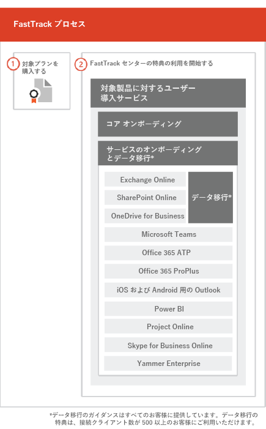

# FastTrack プロセスThe FastTrack Process

FastTrack プロセスでは、オンボーディングと、ユーザー採用サービスが提供されます。The FastTrack process provides onboarding and user adoption services. 
  
オンボーディングは、次のもので構成されます。Onboarding consists of:
  
- *コア オンボーディング* — これらのタスクは、必要に応じてテナント構成と Azure Active Directory (Azure AD) の統合に必要です。コア オンボーディングは、他の対象のサービスのオンボーディングのベースラインも提供します。*Core onboarding* — These are tasks required for tenant configuration and integration with Azure Active Directory (Azure AD) if needed. Core onboarding also provides the baseline for onboarding other eligible services. 
- *サービス オンボーディングと移行* — サービス オンボーディング タスクはテナントのシナリオを有効にします。[データ移行](O365-data-migration.md)では、データ移行 (電子メールとファイルを含む) をカバーしています。*Service onboarding and migration* — Service onboarding tasks enable scenarios in your tenant. Data migration (including email and files) is covered in [Data Migration](O365-data-migration.md). 
    
ユーザー採用サービスは、ユーザーが使用できるサービスを認識し、そのサービスを使用してビジネス価値を高めることができるようにするガイダンスを提供するタスクで構成されています。この支援は、オンボーディング アクティビティと並行して行われます。User adoption services are comprised of tasks that provide guidance for you to ensure your users are aware of the eligible services and can use them to drive business value. This assistance occurs in parallel to onboarding activities.
  
> [!NOTE]
> FastTrack はお客様に、推奨されるアプローチ、ガイダンス、迅速かつ予測可能な結果を設計するためのベスト プラクティスを提供します。このガイダンス以外の方法での展開を考えている場合は、オンボーディング エクスペリエンスとサービスの使用法に影響が生じる可能性があります。ガイダンスは、口頭および書面のサポートの組み合わせと定義されています。FastTrack のスペシャリストがガイダンスを提供する際に、FastTrack の担当者がお客様の代わりに操作することはできません。サブスクリプションが最新の状態になっていれば、FastTrack サービスを使用して、条件を満たすあらゆる製品ワークロードのオンボーディングと採用を行えます。FastTrack provides customers with a recommended approach, guidance, and best practices engineered to deliver quick and predictable outcomes. If you choose to deploy outside of this guidance, your onboarding experience and usage of the service may be impacted. Guidance is defined as a combination of verbal and written assistance. When FastTrack Specialists provide guidance, FastTrack personnel cannot act on your behalf. You can use FastTrack services to onboard and adopt any qualifying product workload as long as your subscription is current. 
  
## オンボーディング プロセスThe onboarding process

次の図は、オンボーディング プロセスを示しています。The following diagram illustrates the onboarding process.
  

  
[Microsoft 365 管理センター](https://go.microsoft.com/fwlink/?linkid=2032704)または [FastTrack サイト](https://go.microsoft.com/fwlink/?linkid=780698)からヘルプを取得することができます。You can get help through the [Microsoft 365 admin center](https://go.microsoft.com/fwlink/?linkid=2032704) or the [FastTrack site](https://go.microsoft.com/fwlink/?linkid=780698). 

[Microsoft 365 管理センター](https://go.microsoft.com/fwlink/?linkid=2032704)からヘルプを取得するには、管理者は管理センターにサインインして、**[サポートを依頼する]** をクリックします。To get help through the [Microsoft 365 admin center](https://go.microsoft.com/fwlink/?linkid=2032704), your admin signs into the admin center and then clicks the **Need help?** widget. 

[FastTrack サイト](https://go.microsoft.com/fwlink/?linkid=780698)からヘルプを取得するには、次の手順を実行します。To get help through the [FastTrack site](https://go.microsoft.com/fwlink/?linkid=780698): 
1.  [FastTrack サイト](https://go.microsoft.com/fwlink/?linkid=780698)にサインインします。Sign in to the [FastTrack site](https://go.microsoft.com/fwlink/?linkid=780698). 
2.  **[サービス]** を選択します。Select **Services**.
3.  **Microsoft 365 サポート要求**フォームに必要事項を記入します。Complete the **Request for Assistance with Microsoft 365** form. 
> [!NOTE]
>  パートナーが Office 365 テナント一覧に表示されている場合、このオプションは表示されません。パートナーにサポートを依頼してください。If you have a partner listed in your Office 365 tenant, you won't see this option. Please consult your partner for assistance. 
  
 また、テナントで利用できるサービスの一覧にある [FastTrack サイト](https://go.microsoft.com/fwlink/?linkid=780698)から FastTrack Center のサポートを依頼できます。You can also ask for FastTrack Center help from the [FastTrack site](https://go.microsoft.com/fwlink/?linkid=780698) in the list of available services for your tenant. 
    
 オンボーディング支援を開始すると、オンライン会議のスケジュールが決まります。Once onboarding assistance starts, we set up a schedule of online meetings.
    
パートナーも顧客の代理として、[FastTrack サイト](https://go.microsoft.com/fwlink/?linkid=780698)からヘルプを取得することができます。次の手順を実行します。Partners can also get help through the [FastTrack site](https://go.microsoft.com/fwlink/?linkid=780698) on behalf of a customer. To do so:
1.  [FastTrack サイト](https://go.microsoft.com/fwlink/?linkid=780698)にサインインします。Sign in to the [FastTrack site](https://go.microsoft.com/fwlink/?linkid=780698). 
2.  **[顧客]** を選択します。Select **My Customers**.
3.  顧客を検索するか、顧客リストから選択します。Search for your customer or select them from your customer list.
4.  **[サービス]** を選択します。Select **Services**.
5.  **Microsoft 365 サポート要求**フォームに必要事項を記入します。Complete the **Request for Assistance with Microsoft 365** form. 

次の表は、プロセスでの役割と責任を一覧にしたものです。The following table lists roles and responsibilities for the process.
    
|||
|:-----|:-----|
|**役割****Role**   |**責任****Responsibility**   |
|**FastTrack スペシャリスト****FastTrack Specialist**   |すべてのオンボーディング、移行、ユーザー採用サービスをリモートで提供します。Provides all onboarding, migration, and user adoption services remotely.    ツールと発行されているドキュメントを組み合わせて活用し、お客様をリモートでサポートします。Assists you remotely by using a combination of tools and published documentation.   お客様またはお客様の担当者との作業を直接行います。Works directly with you or your representative.   メールとデータ移行についてもガイダンスを行います。Provides email and data migration guidance.|
|**FastTrack センター****FastTrack Center**    |コア オンボーディングおよびサービス オンボーディング、さらには使用できるサービスの採用プランニングが成功するようにガイダンスを提供します。Provides guidance with core and service onboarding and planning successful adoption of eligible services.    指定された地域の通常業務時間内に利用できるサポートを提供します。Provides assistance and is available during normal business hours for a given region.   繁体字中国語、簡体字中国語 (リソースは標準中国語のみ)、英語、フランス語、ドイツ語、イタリア語、日本語、韓国語、ポルトガル語 (ブラジル)、スペイン語、タイ語、ベトナム語によるサポートを提供します。Provides assistance in Traditional Chinese and Simplified Chinese (resources speak Mandarin only), English, French, German, Italian, Japanese, Korean, Portuguese (Brazil), Spanish, Thai, and Vietnamese.|

  

