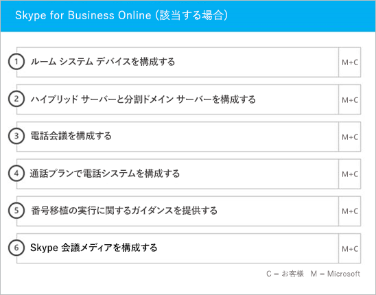

# オンボーディングと移行のフェーズ

Office 365 オンボーディングには、開始、評価、修復、有効化の 4 つの主なフェーズがあります。次の図に示されているように、これらのフェーズの後にオプションでデータ移行フェーズを続けることもできます。
  

  
> [!NOTE]
>Office 365 US Government でのオンボーディングおよび移行については、「[Office 365 US Government でのオンボーディングおよび移行](US-Gov-appendix-onboarding-and-migration.md)」を参照してください。 

各フェーズのタスクの詳細については、「[FastTrack の責任範囲](O365-fasttrack-responsibilities.md)」と「[お客様の責任](O365-your-responsibilities.md)」をご覧ください。
  
## 開始フェーズ

適切な数とタイプのライセンスを購入した後、購入確認メールのガイダンスに従って、ライセンスを既存や新規のテナントに関連付けます。 
  
Office 365 管理センターまたは [FastTrack サイト](https://go.microsoft.com/fwlink/?linkid=780698) からヘルプを取得することができます。Office 365 管理センターからヘルプを取得するには、管理者は管理センターにサインインして、 **[サポートを依頼する]** をクリックします。 [FastTrack サイト](https://go.microsoft.com/fwlink/?linkid=780698) からヘルプを取得するには、 **[サービス]** をクリックして、 **[Office 365 のサポートを要求する]** フォームを完成させます。 
    
> [!NOTE]
>  パートナーが Office 365 テナント一覧に表示されている場合、このオプションは表示されません。パートナーにサポートを依頼してください。 
  
パートナーもお客様の代理として、[FastTrack サイト](https://go.microsoft.com/fwlink/?linkid=780698) からヘルプを取得することができます。そのために、パートナーはサイトにサインインして、顧客レコードを選択します。 **[サービス]** をクリックし、 **[Office 365 のサポートを要求する]** フォームを完成させます。 

また、テナントで利用できるサービスの一覧にある [FastTrack サイト](https://go.microsoft.com/fwlink/?linkid=780698)から FastTrack Center のサポートを依頼できます。 
    
このフェーズで、オンボーディング プロセスについて説明し、データを検証し、キックオフ ミーティングのスケジュールを設定します。これには、共に作業して、サービスの使用法や、サービスの利用状況を促進するための組織の目標や計画について理解することも含まれます。
  

  
## 評価フェーズ

FastTrack マネージャーは、採用チーム関係者との対話型の成功プランニング電話会議を実施します。これによって、購入した使用可能なサービスの機能、成功に必要な主要な基盤、サービスの利用状況を促進するための手法、サービスが価値を生み出すために使用できるシナリオがお客様に紹介されます。成功プランニングを援助し、必要に応じて主要な分野に関するフィードバックを提供します。
  
FastTrack スペシャリストはお客様と一緒にソース環境と要件を評価します。FastTrack スペシャリストは、データを収集するためのツールを提供するとともに、帯域幅の要件の推定およびインターネット ブラウザー、クライアント オペレーティング システム、ドメイン ネーム システム (DNS)、ネットワーク、インフラストラクチャ、ID システムの評価をお客様が行い、オンボーディングを行うために変更の必要があるかどうかを判断する方法を説明します。 
  
現在のセットアップ環境に基づいて、お使いのソース環境を Office 365 へと正常にオンボーディングするために (必要な場合にはメールボックス移行やデータ移行を正常に行うためにも) 必要な最低要件を満たすような修復プランを提供します。エンドユーザーの価値や採用を増やすための一連の推奨アクティビティを示します。また、修復フェーズのための適切なチェックポイント電話会議を設定します。
  

  
## 修復フェーズ

必要であれば、ソース環境に基づいて修復タスクを行い、各サービスのオンボーディング、採用、移行を行うための要件を満たすことができます。
  

  
また、エンド ユーザーの価値と採用を増やすための一連の推奨アクティビティを示します。有効化フェーズを開始する前に、修復アクティビティの結果を一緒に検証して、先に進む準備ができているかを確認します。 
  
このフェーズでは、FastTrack マネージャーと一緒に達成計画を立て、組織でサービスを利用できるようにし、サービスの利用状況を促進するうえで役立つ適切なリソースとベスト プラクティスについてお客様にガイダンスを提供します。
  
## 有効化フェーズ

すべての修復アクティビティを完了したら、フォーカスは、サービス利用のためのコア インフラストラクチャの構成、Office 365 のプロビジョニング、サービス採用を促進するアクティビティの実行へと移行します。 
  
## コア

コア オンボーディングには、サービスのプロビジョニングおよびテナントと ID の統合が含まれます。また、Exchange Online、SharePoint Online、Skype for Business Online などのオンボーディング サービスの基盤を提供する手順も含まれています。お客様と FastTrack マネージャーは継続してチェックポイント会議を開催し、目標に対する進捗状況を評価し、必要な追加の援助を判別します。
  

  

  
> [!NOTE]
> WAP は、Web アプリケーション プロキシ (Web Application Proxy) を略したものです。SSL は、Secure Sockets Layer を略したものです。SDS は、School Data Sync を略したものです。SDS の詳細については、「[Microsoft School Data Sync へようこそ](https://go.microsoft.com/fwlink/?linkid=871480)」を参照してください。 
  
1 つ以上の対象サービスをオンボーディングする作業は、コア オンボーディングを終えてから開始できます。
  
## Exchange Online

Exchange Online の場合、組織がメールをすぐに使用できるようにするプロセスを案内します。正確な手順は、お客様のソース環境とメールの移行プランによって異なりますが、次の作業のガイダンス提供が含まれます。
- Office 365 で検証される、メールが有効なすべてのドメインの Exchange Online Protection (EOP) 機能の設定。
    > [!NOTE]
    > メール交換 (MX) レコードは、Office 365 をポイントする必要があります。 
- MX レコードが Office 365 をポイントしたら、サブスクリプション サービスの一部である Exchange Online Advanced Threat Protection (ATP) 機能を設定する。この機能は、Exchange Online Protection のマルウェア対策の設定の一部として構成されます。
- ファイアウォール ポートの構成。
- DNS のセットアップ。必須の自動検出、Sender Policy Framework (SPF)、および MX レコード (必要な場合) が含まれます。 
- ソース メッセージング環境と Exchange Online との間のメール フローをセットアップします (必要な場合)。
- ソースのメッセージング環境から Office 365 にメール移行を実行。
    > [!NOTE]
    > メールとデータの移行についての詳細は、「[データ移行](O365-data-migration.md)」をご覧ください。 
  

  
## Sharepoint Online と OneDrive for Business

SharePoint Online と OneDrive for Business では、次の作業のガイダンスを提供します。
- DNS の設定。
- ファイアウォール ポートの構成。
- ユーザーとライセンスのプロビジョニング。   
- ハイブリッド検索、ハイブリッド サイト、ハイブリッド分類、コンテンツ タイプ、ハイブリッド セルフサービス サイト作成 (SharePoint Server 2013 のみ)、拡張アプリ起動ツール、ハイブリッド OneDrive for Business、エクストラネット サイトなどの SharePoint ハイブリッド 機能の構成。
    
FastTrack スペシャリストは、ツールとドキュメントを組み合わせて使用することにより、また適切な場合や実行可能な場合には構成タスクを実行することにより、Office 365 へのデータ移行の手順に関するガイダンスを提供します。
  

  
## OneDrive for Business

OneDrive for Business の場合は、現在 SharePoint を使っているかどうかによって、さらに使っている場合はそのバージョンによって、作業手順が異なります。 
  

  
## Skype for Business Online

Skype for Business Online では、次の作業のガイダンスを提供します。
- ファイアウォール ポートの構成。
- DNS の設定。   
- ルーム システム デバイスのアカウントの作成。   
- サポートされる Skype for Business Online クライアントの展開。  
- オンプレミスの Lync 2010、Lync 2013、Skype for Business 2015 サーバー環境と、Skype for Business Online テナント (該当する場合)、通話プラン、Skype 会議ブロードキャスト、電話システムおよび通話プラン (利用可能なマーケットのみ) との間で、分割ドメイン サーバー構成を確立する。
    

  

  
## Microsoft Teams

Microsoft Teams では、次の作業のガイダンスを提供します。
- 最小要件の確認。  
- ファイアウォール ポートの構成。   
- DNS の設定。 
- Microsoft Teams が Office 365 テナントで有効であることの確認。  
- ユーザーのライセンスの有効化と無効化。
    

  
## Power BI

Power BI では、次の作業のガイダンスを提供します。 
- Power BI ライセンスの割り当て。
- Power BI Desktop アプリの展開。
    
## Project Online

Project Online では、次の作業のガイダンスを提供します。
  
- Project Online が依存している基本的な SharePoint の機能の確認。   
- テナントへの Project Online サービスの追加 (ユーザーへのサブスクリプションの追加を含みます)。  
- エンタープライズ リソース共有元 (ERP) のセットアップ。 
- 最初のプロジェクトの作成。 
    

  
## Project Online Professional と Project Online Premium

Project Online Professional と Project Online Premium では、次の作業のガイダンスを提供します。
- 展開の問題への対応。
- Office 365 管理センター および Windows PowerShell を使用したエンド ユーザー ライセンスの割り当て。  
- クイック実行を使用した Office 365 ポータルからの Project Online デスクトップ クライアント のインストール。
- Office 展開ツールを使用した更新設定の構成。  
- Office 展開ツールで使用するための configuration.xml ファイルの作成サポートを含む、Project Online デスクトップ クライアント 用の 1 つのオンサイト配布サーバーのセットアップ。  
- Project Online デスクトップ クライアント の Project Online Professional または Project Online Premium への接続。
    

  
## Yammer Enterprise

Yammer では、Yammer Enterprise サービスを有効にするためのガイダンスを提供します。
  
## Office 365 ProPlus

Office 365 ProPlus では、次の作業のガイダンスを提供します。
- 展開の問題への対応。   
- Office 365 管理センター および Windows PowerShell を使用したエンド ユーザー ライセンスの割り当て。 
- クイック実行を使用した Office 365 ポータルからの Office 365 ProPlus のインストール。   
- iOS、Android、または Windows Mobile デバイスへの Office Mobile アプリ (Outlook Mobile、Word Mobile、Excel Mobile、PowerPoint Mobile など) のインストール。   
- Office 展開ツールを使用した更新設定の構成。   
- Office 展開ツールで使用するための configuration.xml ファイルの作成サポートを含む、Office 365 ProPlus 用の 1 つのオンサイト配布サーバーのセットアップ。  
- System Center Configuration Manager パッケージの作成サポートを含む、Microsoft System Center Configuration Manager を使用した展開。
    

  
## Microsoft StaffHub

Microsoft StaffHub では、次の作業のガイダンスを提供します。
- Microsoft StaffHub が Office 365 テナントで有効であることの確認。
- ユーザーのライセンスの有効化と無効化。
- コア製品の機能。 
- Microsoft StaffHub のダウンロード場所。
    

  

  

