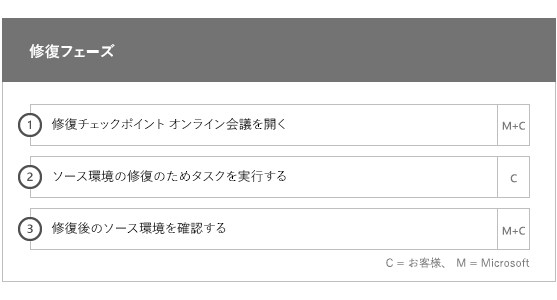
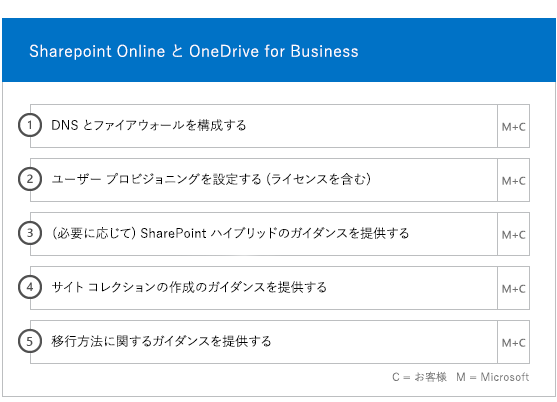

# オンボーディングと移行のフェーズOnboarding and Migration Phases

> [!CAUTION]
> このコンテンツは現在は使用されていないため、削除する予定です。This content is no longer current and is scheduled for removal. 現在のコンテンツに対して左側のナビゲーション内の目次を使用します。Use the table of contents in the left-hand navigation for current content.

Office 365 オンボーディングには、開始、評価、修復、有効化の 4 つの主なフェーズがあります。次の図に示されているように、これらのフェーズの後にオプションでデータ移行フェーズを続けることもできます。Office 365 onboarding has four primary phases—Initiate, Assess, Remediate, and Enable. You can follow these phases with an optional data migration phase as shown in the following figure.
  

  
> [!NOTE]
>Office 365 US Government でのオンボーディングおよび移行については、「[Office 365 US Government でのオンボーディングおよび移行](US-Gov-appendix-onboarding-and-migration.md)」を参照してください。For information on onboarding and migration for Office 365 US Government, see [Onboarding and Migration for Office 365 US Government](US-Gov-appendix-onboarding-and-migration.md). 

各フェーズのタスクの詳細については、「[FastTrack の責任範囲](O365-fasttrack-responsibilities.md)」と「[お客様の責任](O365-your-responsibilities.md)」をご覧ください。For detailed tasks for each phase, see [FastTrack Responsibilities](O365-fasttrack-responsibilities.md) and [Your Responsibilities](O365-your-responsibilities.md).
  
## 開始フェーズInitiate phase

適切な数とタイプのライセンスを購入した後、購入確認メールのガイダンスに従って、ライセンスを既存や新規のテナントに関連付けます。After you purchase the appropriate number and types of licenses, follow the guidance from the purchase confirmation email to associate the licenses to your existing or new tenant. 
  
[Microsoft 365 管理センター](https://go.microsoft.com/fwlink/?linkid=2032704)または [FastTrack サイト](https://go.microsoft.com/fwlink/?linkid=780698)からヘルプを取得することができます。You can get help through the [Microsoft 365 admin center](https://go.microsoft.com/fwlink/?linkid=2032704) or the [FastTrack site](https://go.microsoft.com/fwlink/?linkid=780698). 

[Microsoft 365 管理センター](https://go.microsoft.com/fwlink/?linkid=2032704)からヘルプを取得するには、管理者は管理センターにサインインして、**[サポートを依頼する]** をクリックします。To get help through the [Microsoft 365 admin center](https://go.microsoft.com/fwlink/?linkid=2032704), your admin signs into the admin center and then clicks the **Need help?** widget. 

[FastTrack サイト](https://go.microsoft.com/fwlink/?linkid=780698)からヘルプを取得するには、次の手順を実行します。To get help through the [FastTrack site](https://go.microsoft.com/fwlink/?linkid=780698): 
1.    [FastTrack サイト](https://go.microsoft.com/fwlink/?linkid=780698)にサインインします。Sign in to the [FastTrack site](https://go.microsoft.com/fwlink/?linkid=780698). 
2.    ランディング ページの上部にある **[クイック アクション]** から **[Microsoft 365 サポート要求]** を選択します。Select **Request assistance with Microsoft 365** from the **quick actions** on the top of your landing page.
3.    **Microsoft 365 サポート要求**フォームに必要事項を記入します。Complete the **Request Assistance with Microsoft 365** form.
  
パートナーも顧客の代理として、[FastTrack サイト](https://go.microsoft.com/fwlink/?linkid=780698)からヘルプを取得することができます。次の手順を実行します。Partners can also get help through the [FastTrack site](https://go.microsoft.com/fwlink/?linkid=780698) on behalf of a customer. To do so:
1.    [FastTrack サイト](https://go.microsoft.com/fwlink/?linkid=780698)にサインインします。Sign in to the [FastTrack site](https://go.microsoft.com/fwlink/?linkid=780698). 
2.    ランディング ページの上部にある **[クイック アクション]** から **[Microsoft 365 サポート要求]** を選択します。Select **Request assistance with Microsoft 365** from the **quick actions** on the top of your landing page.
3.    顧客名、ドメイン、または TPID を入力して顧客を検索します。Search for your customer by entering the customer name, domain, or TPID.
4.    検索結果から顧客を選択します。Select customer from the search results.
5.    **Microsoft 365 サポート要求**フォームに必要事項を記入します。Complete the **Request Assistance with Microsoft 365** form.

テナントが利用できるサービスの一覧にある [FastTrack サイト](https://go.microsoft.com/fwlink/?linkid=780698) から FastTrack センター サポートを依頼することもできます。You can also ask for FastTrack Center help from the [FastTrack site](https://go.microsoft.com/fwlink/?linkid=780698) in the list of available services for your tenant. 
    
このフェーズで、オンボーディング プロセスについて説明し、データを検証し、キックオフ ミーティングのスケジュールを設定します。これには、共に作業して、サービスの使用法や、サービスの利用状況を促進するための組織の目標や計画について理解することも含まれます。During this phase, we discuss the onboarding process, verify your data, and set up a kickoff meeting. This includes working with you to understand how you intend to use the service and your organization's goals and plans to drive service usage.
  

  
## 評価フェーズAssess phase

FastTrack マネージャーは、採用チーム関係者との対話型の成功プランニング電話会議を実施します。これによって、購入した使用可能なサービスの機能、成功に必要な主要な基盤、サービスの利用状況を促進するための手法、サービスが価値を生み出すために使用できるシナリオがお客様に紹介されます。成功プランニングを援助し、必要に応じて主要な分野に関するフィードバックを提供します。Your FastTrack Manager conducts an interactive success planning call with you and your adoption team. This introduces you to the capabilities of the eligible services you purchased, the key foundations you need for success, the methodology for driving usage of the service, and scenarios you can use to get value from the services. We assist you in success planning and provide feedback on key areas (as needed).
  
FastTrack スペシャリストはお客様と一緒にソース環境と要件を評価します。FastTrack スペシャリストは、データを収集するためのツールを提供するとともに、帯域幅の要件の推定およびインターネット ブラウザー、クライアント オペレーティング システム、ドメイン ネーム システム (DNS)、ネットワーク、インフラストラクチャ、ID システムの評価をお客様が行い、オンボーディングを行うために変更の必要があるかどうかを判断する方法を説明します。FastTrack Specialists work with you to assess your source environment and the requirements. We provide tools for you to gather data about your environment and  guide you through estimating bandwidth requirements and assessing your internet browsers, client operating systems, Domain Name System (DNS), network, infrastructure, and identity system to determine if any changes are required for onboarding. 
  
現在のセットアップ環境に基づいて、お使いのソース環境を Office 365 へと正常にオンボーディングするために (必要な場合にはメールボックス移行やデータ移行を正常に行うためにも) 必要な最低要件を満たすような修復プランを提供します。エンドユーザーの価値や採用を増やすための一連の推奨アクティビティを示します。また、修復フェーズのための適切なチェックポイント電話会議を設定します。Based on your current setup, we provide a remediation plan that brings your source environment up to the minimum requirements for successful onboarding to Office 365 and, if needed, for successful mailbox and/or data migration. We provide a set of suggested activities to increase end user value and adoption. We also set up appropriate checkpoint calls for the Remediate phase.
  

  
## 修復フェーズRemediate phase

必要であれば、ソース環境に基づいて修復タスクを行い、各サービスのオンボーディング、採用、移行を行うための要件を満たすことができます。You do the remediation tasks based on your source environment so that you meet the requirements for onboarding, adopting, and migrating each service as needed.
  

  
また、エンド ユーザーの価値と採用を増やすための一連の推奨アクティビティを示します。有効化フェーズを開始する前に、修復アクティビティの結果を一緒に検証して、先に進む準備ができているかを確認します。We also provide a set of suggested activities to increase end user value and adoption. Before beginning the Enable phase, we jointly verify the outcomes of the remediation activities to make sure you're ready to proceed. 
  
このフェーズでは、FastTrack マネージャーと一緒に達成計画を立て、組織でサービスを利用できるようにし、サービスの利用状況を促進するうえで役立つ適切なリソースとベスト プラクティスについてお客様にガイダンスを提供します。During this phase, your FastTrack Manager works with you on success planning, guiding you to the right resources and best practices to provide guidance for you to make the service available to your organization and drive usage across the services.
  
## 有効化フェーズEnable phase

すべての修復アクティビティを完了したら、フォーカスは、サービス利用のためのコア インフラストラクチャの構成、Office 365 のプロビジョニング、サービス採用を促進するアクティビティの実行へと移行します。When all remediation activities are complete, the focus shifts to configuring the core infrastructure for service consumption, provisioning Office 365, and conducting the activities to drive service adoption. 
  
## コアCore

コア オンボーディングには、サービスのプロビジョニングおよびテナントと ID の統合が含まれます。また、Exchange Online、SharePoint Online、Skype for Business Online などのオンボーディング サービスの基盤を提供する手順も含まれています。お客様と FastTrack マネージャーは継続してチェックポイント会議を開催し、目標に対する進捗状況を評価し、必要な追加の援助を判別します。Core onboarding involves service provisioning and tenant and identity integration. It also includes steps for providing a foundation for onboarding services like Exchange Online, SharePoint Online, and Skype for Business Online. You and your FastTrack Manager continue to have success planning checkpoint meetings to evaluate progress against your goals and determine what further assistance you need.
  

  

  
> [!NOTE]
> WAP は、Web アプリケーション プロキシ (Web Application Proxy) を略したものです。SSL は、Secure Sockets Layer を略したものです。SDS は、School Data Sync を略したものです。SDS の詳細については、「[Microsoft School Data Sync へようこそ](https://go.microsoft.com/fwlink/?linkid=871480)」を参照してください。WAP stands for Web Application Proxy. SSL stands for Secure Sockets Layer. SDS stands for School Data Sync. For more information on SDS, see [Welcome to Microsoft School Data Sync](https://go.microsoft.com/fwlink/?linkid=871480). 
  
1 つ以上の対象サービスをオンボーディングする作業は、コア オンボーディングを終えてから開始できます。Onboarding for one or more eligible services can begin once core onboarding is finished.
  
## Exchange OnlineExchange Online

Exchange Online の場合、組織がメールをすぐに使用できるようにするプロセスを案内します。正確な手順は、お客様のソース環境とメールの移行プランによって異なりますが、次の作業のガイダンス提供が含まれます。For Exchange Online, we guide you through the process to get your organization ready to use email. The exact steps, depending on your source environment and your email migration plans, can include providing guidance for:
- Office 365 で検証される、メールが有効なすべてのドメインの Exchange Online Protection (EOP) 機能の設定。Setting up Exchange Online Protection (EOP) features for all mail-enabled domains validated in Office 365.
    > [!NOTE]
    > メール交換 (MX) レコードは、Office 365 をポイントする必要があります。Your mail exchange (MX) records must point to Office 365. 
- Office 365 Advanced Threat Protection (ATP) 機能の設定 (サブスクリプション サービスに含まれている場合)。Setting up the Office 365 Advanced Threat Protection (ATP) feature if it's part of your subscription service. 詳細については、「[Office 365 Advanced Threat Protection](#office-365-advanced-threat-protection)」を参照してください。For more information, see [Office 365 Advanced Threat Protection](#office-365-advanced-threat-protection).
- サブスクリプション サービスの一部として、Office 365 で検証済みのすべてのメールが有効なドメインに、データ損失防止 (DLP) 機能を設定します。この設定は、MX レコードが Office 365 をポイントすると実行されます。Setting up the data loss prevention (DLP) feature for all mail-enabled domains validated in Office 365 as part of your subscription service. This is done once your MX records point to Office 365.
- サブスクリプション サービスの一部として、Office 365 で検証済みのすべてのメールが有効なドメインに、Office 365 Message Encryption (OME) を設定します。この設定は、MX レコードが Office 365 をポイントすると実行されます。Setting up Office 365 Message Encryption (OME) for all mail-enabled domains validated in Office 365 as part of your subscription service. This is done once your MX records point to Office 365.

> [!NOTE]
> メールボックス レプリケーション サービス (MRS) では、オンプレミスのメールボックスから対応する Exchange Online メールボックスへの Information Rights Management (IRM) で管理されたメールの移行が試行されます。The Mailbox Replication service (MRS) attempts to migrate Information Rights Managed (IRM) emails from your on-premises mailbox to the corresponding Exchange Online mailbox. 移行後に保護されたコンテンツを読み取る機能は、Active Directory Rights Managed サービス (AD RMS) テンプレートから Azure Rights Management サービス (Azure RMS) への、お客様によるマッピングとコピーに依存しています。Ability to read the protected content post-migration depends on the customer mapping and copying Active Directory Rights Managed Services (AD RMS) templates to the Azure Rights Management Service (Azure RMS).

- ファイアウォール ポートの構成。Configuring firewall ports.
- DNS のセットアップ。必須の自動検出、Sender Policy Framework (SPF)、および MX レコード (必要な場合) が含まれます。Setting up DNS, including the required Autodiscover, sender policy framework (SPF), and MX records (as needed). 
- ソース メッセージング環境と Exchange Online との間のメール フローをセットアップします (必要な場合)。Setting up email flow between your source messaging environment and Exchange Online (as needed).
- ソースのメッセージング環境から Office 365 にメール移行を実行。Undertaking mail migration from your source messaging environment to Office 365.
- メールボックス クライアント (Outlook for Windows、Outlook on the web、iOS および Android 用の Outlook) の構成。Configuring mailbox clients (Outlook for Windows, Outlook on the web, and Outlook for iOS and Android).
    > [!NOTE]
    > メールとデータの移行についての詳細は、「[データ移行](O365-data-migration.md)」を参照してください。For more information on mail and data migration, see [Data Migration](O365-data-migration.md). 
  

  
## Sharepoint Online と OneDrive for BusinessSharePoint Online and OneDrive for Business

SharePoint Online と OneDrive for Business では、次の作業のガイダンスを提供します。For SharePoint Online and OneDrive for Business, we provide guidance for:
- DNS の設定。Setting up DNS.
- ファイアウォール ポートの構成。Configuring firewall ports.
- ユーザーとライセンスのプロビジョニング。Provisioning users and licenses.   
- ハイブリッド検索、ハイブリッド サイト、ハイブリッド分類、コンテンツ タイプ、ハイブリッド セルフサービス サイト作成 (SharePoint Server 2013 のみ)、拡張アプリ起動ツール、ハイブリッド OneDrive for Business、エクストラネット サイトなどの SharePoint ハイブリッド機能の構成。Configuring SharePoint hybrid features, like hybrid search, hybrid sites, hybrid taxonomy, content types, hybrid self-service site creation (SharePoint Server 2013 only), extended app launcher, hybrid OneDrive for Business, and extranet sites.
    
FastTrack スペシャリストは、ツールとドキュメントを組み合わせて使用することにより、また適切な場合や実行可能な場合には構成タスクを実行することにより、Office 365 へのデータ移行の手順に関するガイダンスを提供します。FastTrack Specialists provide guidance on data migration to Office 365 by using a combination of tools and documentation and by performing configuration tasks where applicable and feasible.
  

  
## OneDrive for BusinessOneDrive for Business

OneDrive for Business の場合は、現在 SharePoint を使っているかどうかによって、さらに使っている場合はそのバージョンによって、作業手順が異なります。For OneDrive for Business, the steps depend on if you're currently using SharePoint, and if so, which version. 
  

  
## Office 365 Advanced Threat ProtectionOffice 365 Advanced Threat Protection

Office 365 ATP では、次の作業のガイダンスを提供します。For Office 365 ATP, we provide guidance for:
- 安全なリンク、安全な添付ファイル、フィッシング詐欺対策の有効化。Enabling Safe Links, Safe Attachments, and anti-phishing. 
- 自動化、調査、応答の構成。Configuring automation, investigation, and response.
- 攻撃シミュレータの使用。Using Attack Simulator.
- レポート作成と脅威分析。Reporting and threat analytics.

## Microsoft 情報ガバナンスMicrosoft Information Governance

Microsoft 情報ガバナンスについては、次のガイダンスを提供します。For Microsoft Information Governance, we provide guidance for:

- 情報ガバナンス。Information governance.
- 保持ラベルとポリシー。Retention labels and policies.
- レコード管理。Records management.
- 削除ポリシー。Deletion policies.
- 通信コンプライアンス。Communication compliance.
- インサイダー リスクの管理Insider risk management 
- Advanced eDiscoveryAdvanced eDiscovery.

## Microsoft 情報保護Microsoft Information Protection

Microsoft の情報保護では、次のガイダンスを提供します。For Microsoft Information Protection, we provide guidance for:
- コンテンツ エクスプローラーとアクティビティ エクスプローラーを使ってデータを把握します。Know your data through content explorer and activity explorer.
- 機密ラベル。Sensitivity labels.
- データの分類。Data classification.
- Microsoft Teams のチャットとチャネルのデータ損失防止 (DLP) ポリシー。Data loss protection (DLP) policies for Microsoft Teams chats and channels.
- 情報の保護。Information protection.
- 統合されたラベル付け。Unified labeling.

## Microsoft TeamsMicrosoft Teams

Microsoft Teams では、次の作業のガイダンスを提供します。For Microsoft Teams, we provide guidance for:
- 最小要件の確認。Confirming minimum requirements.  
- ファイアウォール ポートの構成。Configuring firewall ports.   
- DNS の設定。Setting up DNS. 
- Microsoft Teams が Office 365 テナントで有効であることの確認。Confirming Microsoft Teams is enabled on your Office 365 tenant.  
- ユーザーのライセンスの有効化と無効化。Enabling or disabling user licenses.
    

## Skype for Business OnlineSkype for Business Online

Skype for Business Online では、次の作業のガイダンスを提供します。For Skype for Business Online, we provide guidance for:
- ファイアウォール ポートの構成。Configuring firewall ports.
- DNS の設定。Setting up DNS.   
- ルーム システム デバイスのアカウントの作成。Creating accounts for any room system devices.   
- サポートされる Skype for Business Online クライアントの展開。Deploying a supported Skype for Business Online client.  
- オンプレミスの Lync 2010、Lync 2013、Skype for Business 2015 サーバー環境と、Skype for Business Online テナント (該当する場合)、通話プラン、Skype 会議ブロードキャスト、電話システムおよび通話プラン (利用可能なマーケットのみ) との間で、分割ドメイン サーバー構成を確立する。Establishing split domain server configuration between your on-premises Lync 2010, Lync 2013, or Skype for Business 2015 server environment and Skype for Business Online tenant (if applicable), Calling Plans, Skype Meeting Broadcast, and Phone System and Calling Plans (in available markets).
    

  

  
## Power BIPower BI

Power BI では、次の作業のガイダンスを提供します。For Power BI, we provide guidance for: 
- Power BI ライセンスの割り当て。Assigning Power BI licenses.
- Power BI Desktop アプリの展開。Deploying the Power BI Desktop app.
    
## Project OnlineProject Online

Project Online では、次の作業のガイダンスを提供します。For Project Online, we provide guidance for:
  
- Project Online が依存している基本的な SharePoint の機能の確認。Verifying basic SharePoint functionality that Project Online relies on.   
- テナントへの Project Online サービスの追加 (ユーザーへのサブスクリプションの追加を含みます)。Adding the Project Online service to your tenant (including adding subscriptions to users).  
- エンタープライズ リソース共有元 (ERP) のセットアップ。Setting up the Enterprise Resource Pool (ERP). 
- 最初のプロジェクトの作成。Creating your first project. 
    

  
## Project Online Professional と Project Online PremiumProject Online Professional and Project Online Premium

Project Online Professional と Project Online Premium では、次の作業のガイダンスを提供します。For Project Online Professional and Project Online Premium, we provide guidance for:
- 展開の問題への対応。Addressing deployment issues.
- [Microsoft 365 管理センター](https://go.microsoft.com/fwlink/?linkid=2032704)と Windows PowerShell を使用したエンドユーザー ライセンスの割り当て。Assigning end-user licenses using the [Microsoft 365 admin center](https://go.microsoft.com/fwlink/?linkid=2032704) and Windows PowerShell.  
- クイック実行を使用した Office 365 ポータルからの Project Online デスクトップ クライアントのインストール。Installing Project Online Desktop Client from the Office 365 portal using Click-to-Run.
- Office 365 展開ツールを使用した更新設定の構成。Configuring update settings using the Office 365 Deployment Tool.  
- Office 365 展開ツールで使用するための configuration.xml ファイルの作成サポートを含む、Project Online デスクトップ クライアント用の 1 つのオンサイト配布サーバーのセットアップ。Setting up a single on-site distribution server for Project Online Desktop Client, including assistance with the creation of a configuration.xml file for use with the Office 365 Deployment Tool.  
- Project Online デスクトップ クライアントの Project Online Professional または Project Online Premium への接続。Connecting Project Online Desktop Client to Project Online Professional or Project Online Premium.
    

  
## Yammer EnterpriseYammer Enterprise

Yammer では、Yammer Enterprise サービスを有効にするためのガイダンスを提供します。For Yammer, we provide guidance for enabling the Yammer Enterprise service.
  
## Microsoft 365 アプリMicrosoft 365 Apps

Microsoft 365 アプリに関しては、次に示すガイダンスを提供します。For Microsoft 365 Apps, we provide guidance for:
- 展開の問題への対応。Addressing deployment issues.   
- [Microsoft 365 管理センター](https://go.microsoft.com/fwlink/?linkid=2032704)と Windows PowerShell を使用したエンドユーザー ライセンスとデバイスベース ライセンスの割り当て。Assigning end-user and device-based licenses using the [Microsoft 365 admin center](https://go.microsoft.com/fwlink/?linkid=2032704) and Windows PowerShell. 
- クイック実行を使用した Office 365 ポータルからの Microsoft 365 アプリのインストール。Installing Microsoft 365 Apps from the Office 365 portal using Click-to-Run.   
- iOS または Android デバイスへの Office モバイル アプリ (Outlook Mobile、Word Mobile、Excel Mobile、PowerPoint Mobile など) のインストール。Installing Office Mobile apps (like Outlook Mobile, Word Mobile, Excel Mobile, and PowerPoint Mobile) on your iOS or Android devices.   
- Office 365 展開ツールを使用した更新設定の構成。Configuring update settings using the Office 365 Deployment Tool.   
- ローカルまたはクラウドのインストールの選択とセットアップ。Selection and setup of a local or cloud installation. 
- Office カスタマイズ ツールを使用した Office 展開ツールの構成 XML、または展開パッケージを構成するためのネイティブ XML の作成。Creation of the Office Deployment Tool configuration XML with the Office Customization Tool or native XML to configure the deployment package.  
- Microsoft Endpoint Configuration Manager パッケージの作成サポートを含む、Microsoft Endpoint Configuration Manager を使用した展開。Deployment using Microsoft Endpoint Configuration Manager, including assistance with the creation of Microsoft Endpoint Configuration Manager packaging.
    

  
## iOS および Android 用の OutlookOutlook for iOS and Android

iOS および Android 用の Outlook では、次のガイダンスが用意されています。For Outlook for iOS and Android, we provide guidance for:
- Apple App Store や Google Play からの iOS および Android 用の Outlook のダウンロード。Downloading Outlook for iOS and Android from the Apple App Store and Google Play.
- アカウントの構成、および Exchange Online メールボックスへのアクセス。Configuring accounts and accessing the Exchange Online mailbox.
