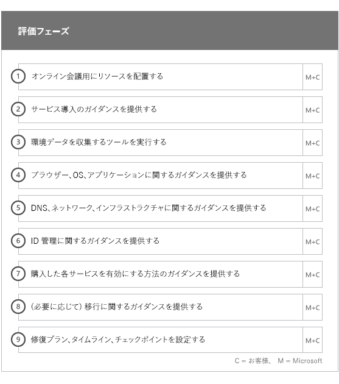
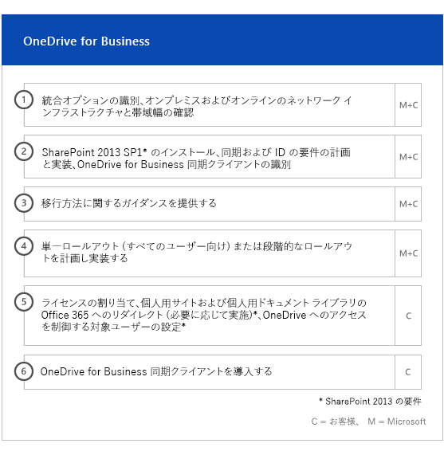

# オンボーディングと移行のフェーズ

Office 365 onboarding has four primary phases—Initiate, Assess, Remediate, and Enable. You can follow these phases with an optional data migration phase as shown in the following figure.
  

  
> [!NOTE]
>Office 365 US Government でのオンボーディングおよび移行については、「[Office 365 US Government でのオンボーディングおよび移行](US-Gov-appendix-onboarding-and-migration.md)」を参照してください。 

各フェーズのタスクの詳細については、「[FastTrack の責任範囲](O365-fasttrack-responsibilities.md)」と「[お客様の責任](O365-your-responsibilities.md)」をご覧ください。
  
## 開始フェーズ

適切な数とタイプのライセンスを購入した後、購入確認メールのガイダンスに従って、ライセンスを既存や新規のテナントに関連付けます。 
  
[Microsoft 365 管理センター](https://go.microsoft.com/fwlink/?linkid=2032704)または [FastTrack サイト](https://go.microsoft.com/fwlink/?linkid=780698)からヘルプを取得することができます。 

[Microsoft 365 管理センター](https://go.microsoft.com/fwlink/?linkid=2032704)からヘルプを取得するには、管理者は管理センターにサインインして、**[サポートを依頼する]** をクリックします。 

[FastTrack サイト](https://go.microsoft.com/fwlink/?linkid=780698)からヘルプを取得するには、次の手順を実行します。 
1.    [FastTrack サイト](https://go.microsoft.com/fwlink/?linkid=780698)にサインインします。 
2.    ランディング ページの上部にある**クイック操作**から [**Microsoft 365 のサポートを依頼する**] を選択するか、展開カードの [**Microsoft 365 のサポートを依頼する**] を選択します。
3.    [**Microsoft 365 のサポートを依頼する**] フォームに必要事項を記入します。 
  
Partners can also get help through the [FastTrack site](https://go.microsoft.com/fwlink/?linkid=780698) on behalf of a customer. To do so:
1.    [FastTrack サイト](https://go.microsoft.com/fwlink/?linkid=780698)にサインインします。 
2.    **[顧客]** を選択します。
3.    顧客を検索するか、顧客リストから選択します。
4.    **[サービス]** を選択します。
5.    [**Microsoft 365 のサポートを依頼する**] フォームに必要事項を記入します。

テナントが利用できるサービスの一覧にある [FastTrack サイト](https://go.microsoft.com/fwlink/?linkid=780698) から FastTrack センター サポートを依頼することもできます。 
    
During this phase, we discuss the onboarding process, verify your data, and set up a kickoff meeting. This includes working with you to understand how you intend to use the service and your organization's goals and plans to drive service usage.
  

  
## 評価フェーズ

Your FastTrack Manager conducts an interactive success planning call with you and your adoption team. This introduces you to the capabilities of the eligible services you purchased, the key foundations you need for success, the methodology for driving usage of the service, and scenarios you can use to get value from the services. We assist you in success planning and provide feedback on key areas (as needed).
  
FastTrack Specialists work with you to assess your source environment and the requirements. We provide tools for you to gather data about your environment and  guide you through estimating bandwidth requirements and assessing your internet browsers, client operating systems, Domain Name System (DNS), network, infrastructure, and identity system to determine if any changes are required for onboarding. 
  
Based on your current setup, we provide a remediation plan that brings your source environment up to the minimum requirements for successful onboarding to Office 365 and, if needed, for successful mailbox and/or data migration. We provide a set of suggested activities to increase end user value and adoption. We also set up appropriate checkpoint calls for the Remediate phase.
  

  
## 修復フェーズ

必要であれば、ソース環境に基づいて修復タスクを行い、各サービスのオンボーディング、採用、移行を行うための要件を満たすことができます。
  

  
We also provide a set of suggested activities to increase end user value and adoption. Before beginning the Enable phase, we jointly verify the outcomes of the remediation activities to make sure you're ready to proceed. 
  
このフェーズでは、FastTrack マネージャーと一緒に達成計画を立て、組織でサービスを利用できるようにし、サービスの利用状況を促進するうえで役立つ適切なリソースとベスト プラクティスについてお客様にガイダンスを提供します。
  
## 有効化フェーズ

すべての修復アクティビティを完了したら、フォーカスは、サービス利用のためのコア インフラストラクチャの構成、Office 365 のプロビジョニング、サービス採用を促進するアクティビティの実行へと移行します。 
  
## コア

Core onboarding involves service provisioning and tenant and identity integration. It also includes steps for providing a foundation for onboarding services like Exchange Online, SharePoint Online, and Skype for Business Online. You and your FastTrack Manager continue to have success planning checkpoint meetings to evaluate progress against your goals and determine what further assistance you need.
  

  

  
> [!NOTE]
> WAP stands for Web Application Proxy. SSL stands for Secure Sockets Layer. SDS stands for School Data Sync. For more information on SDS, see [Welcome to Microsoft School Data Sync](https://go.microsoft.com/fwlink/?linkid=871480). 
  
1 つ以上の対象サービスをオンボーディングする作業は、コア オンボーディングを終えてから開始できます。
  
## Exchange Online

For Exchange Online, we guide you through the process to get your organization ready to use email. The exact steps, depending on your source environment and your email migration plans, can include providing guidance for:
- Office 365 で検証される、メールが有効なすべてのドメインの Exchange Online Protection (EOP) 機能の設定。
    > [!NOTE]
    > メール交換 (MX) レコードは、Office 365 をポイントする必要があります。 
- Office 365 Advanced Threat Protection (ATP) 機能の設定 (サブスクリプション サービスに含まれている場合)。 詳細については、「[Office 365 Advanced Threat Protection](#office-365-advanced-threat-protection)」を参照してください。
- Setting up the data loss prevention (DLP) feature for all mail-enabled domains validated in Office 365 as part of your subscription service. This is done once your MX records point to Office 365.
- Setting up Office 365 Message Encryption (OME) for all mail-enabled domains validated in Office 365 as part of your subscription service. This is done once your MX records point to Office 365.

> [!NOTE]
> メールボックス レプリケーション サービス (MRS) では、オンプレミスのメールボックスから対応する Exchange Online メールボックスへの Information Rights Management (IRM) で管理されたメールの移行が試行されます。 移行後に保護されたコンテンツを読み取る機能は、Active Directory Rights Managed サービス (AD RMS) テンプレートから Azure Rights Management サービス (Azure RMS) への、お客様によるマッピングとコピーに依存しています。

- ファイアウォール ポートの構成。
- DNS のセットアップ。必須の自動検出、Sender Policy Framework (SPF)、および MX レコード (必要な場合) が含まれます。 
- ソース メッセージング環境と Exchange Online との間のメール フローをセットアップします (必要な場合)。
- ソースのメッセージング環境から Office 365 にメール移行を実行。
- メールボックス クライアント (Outlook for Windows、Outlook on the web、iOS および Android 用の Outlook) の構成。
    > [!NOTE]
    > メールとデータの移行についての詳細は、「[データ移行](O365-data-migration.md)」を参照してください。 
  

  
## Sharepoint Online と OneDrive for Business

SharePoint Online と OneDrive for Business では、次の作業のガイダンスを提供します。
- DNS の設定。
- ファイアウォール ポートの構成。
- ユーザーとライセンスのプロビジョニング。   
- ハイブリッド検索、ハイブリッド サイト、ハイブリッド分類、コンテンツ タイプ、ハイブリッド セルフサービス サイト作成 (SharePoint Server 2013 のみ)、拡張アプリ起動ツール、ハイブリッド OneDrive for Business、エクストラネット サイトなどの SharePoint ハイブリッド機能の構成。
    
FastTrack スペシャリストは、ツールとドキュメントを組み合わせて使用することにより、また適切な場合や実行可能な場合には構成タスクを実行することにより、Office 365 へのデータ移行の手順に関するガイダンスを提供します。
  

  
## OneDrive for Business

OneDrive for Business の場合は、現在 SharePoint を使っているかどうかによって、さらに使っている場合はそのバージョンによって、作業手順が異なります。 
  

  
## Office 365 Advanced Threat Protection

Office 365 ATP では、次の作業のガイダンスを提供します。
- 安全なリンク、安全な添付ファイル、フィッシング詐欺対策の有効化。 
- 自動化、調査、応答の構成。
- 攻撃シミュレータの使用。
- レポート作成と脅威分析。

## Microsoft 情報ガバナンス

Microsoft 情報ガバナンスについては、次のガイダンスを提供します。

- 情報ガバナンス。
- 保持ラベルとポリシー。
- レコード管理。
- 削除ポリシー。
- 通信コンプライアンス。
- インサイダー リスクの管理 
- Advanced eDiscovery

## Microsoft 情報保護

Microsoft の情報保護では、次のガイダンスを提供します。
- コンテンツ エクスプローラーとアクティビティ エクスプローラーを使ってデータを把握します。
- 機密ラベル。
- データの分類。
- Microsoft Teams のチャットとチャネルのデータ損失防止 (DLP) ポリシー。
- 情報の保護。
- 統合されたラベル付け。

## Microsoft Teams

Microsoft Teams では、次の作業のガイダンスを提供します。
- 最小要件の確認。  
- ファイアウォール ポートの構成。   
- DNS の設定。 
- Microsoft Teams が Office 365 テナントで有効であることの確認。  
- ユーザーのライセンスの有効化と無効化。
    

## Skype for Business Online

Skype for Business Online では、次の作業のガイダンスを提供します。
- ファイアウォール ポートの構成。
- DNS の設定。   
- ルーム システム デバイスのアカウントの作成。   
- サポートされる Skype for Business Online クライアントの展開。  
- オンプレミスの Lync 2010、Lync 2013、Skype for Business 2015 サーバー環境と、Skype for Business Online テナント (該当する場合)、通話プラン、Skype 会議ブロードキャスト、電話システムおよび通話プラン (利用可能なマーケットのみ) との間で、分割ドメイン サーバー構成を確立する。
    

  

  
## Power BI

Power BI では、次の作業のガイダンスを提供します。 
- Power BI ライセンスの割り当て。
- Power BI Desktop アプリの展開。
    
## Project Online

Project Online では、次の作業のガイダンスを提供します。
  
- Project Online が依存している基本的な SharePoint の機能の確認。   
- テナントへの Project Online サービスの追加 (ユーザーへのサブスクリプションの追加を含みます)。  
- エンタープライズ リソース共有元 (ERP) のセットアップ。 
- 最初のプロジェクトの作成。 
    

  
## Project Online Professional と Project Online Premium

Project Online Professional と Project Online Premium では、次の作業のガイダンスを提供します。
- 展開の問題への対応。
- [Microsoft 365 管理センター](https://go.microsoft.com/fwlink/?linkid=2032704)と Windows PowerShell を使用したエンドユーザー ライセンスの割り当て。  
- クイック実行を使用した Office 365 ポータルからの Project Online デスクトップ クライアントのインストール。
- Office 365 展開ツールを使用した更新設定の構成。  
- Office 365 展開ツールで使用するための configuration.xml ファイルの作成サポートを含む、Project Online デスクトップ クライアント用の 1 つのオンサイト配布サーバーのセットアップ。  
- Project Online デスクトップ クライアントの Project Online Professional または Project Online Premium への接続。
    

  
## Yammer Enterprise

Yammer では、Yammer Enterprise サービスを有効にするためのガイダンスを提供します。
  
## Microsoft 365 アプリ

Microsoft 365 アプリに関しては、次に示すガイダンスを提供します。
- 展開の問題への対応。   
- [Microsoft 365 管理センター](https://go.microsoft.com/fwlink/?linkid=2032704)と Windows PowerShell を使用したエンドユーザー ライセンスとデバイスベース ライセンスの割り当て。 
- クイック実行を使用した Office 365 ポータルからの Microsoft 365 アプリのインストール。   
- iOS または Android デバイスへの Office モバイル アプリ (Outlook Mobile、Word Mobile、Excel Mobile、PowerPoint Mobile など) のインストール。   
- Office 365 展開ツールを使用した更新設定の構成。   
- ローカルまたはクラウドのインストールの選択とセットアップ。 
- Office カスタマイズ ツールを使用した Office 展開ツールの構成 XML、または展開パッケージを構成するためのネイティブ XML の作成。  
- Microsoft Endpoint Configuration Manager パッケージの作成サポートを含む、Microsoft Endpoint Configuration Manager を使用した展開。
    

  
## iOS および Android 用の Outlook

iOS および Android 用の Outlook では、次のガイダンスが用意されています。
- Apple App Store や Google Play からの iOS および Android 用の Outlook のダウンロード。
- アカウントの構成、および Exchange Online メールボックスへのアクセス。
