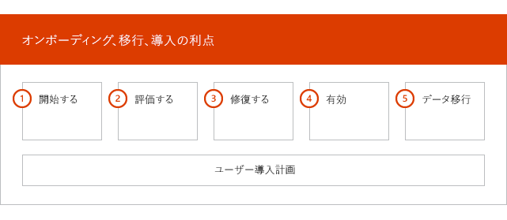
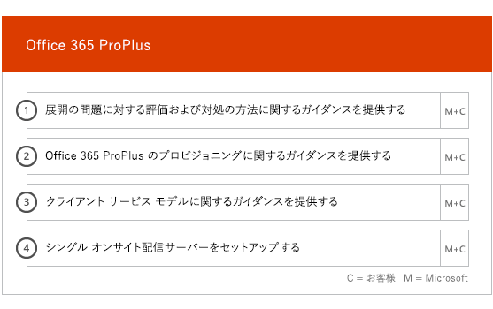
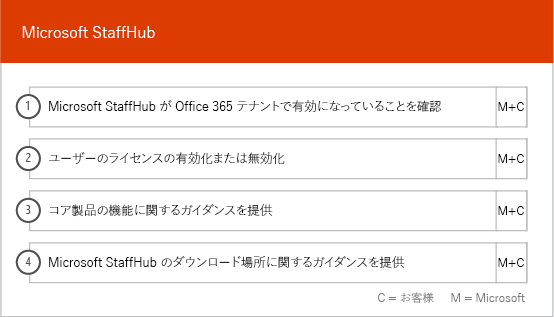

# オンボーディングと移行のフェーズOnboarding and Migration Phases

Office 365 オンボーディングには、開始、評価、修復、有効化の 4 つの主なフェーズがあります。次の図に示されているように、これらのフェーズの後にオプションでデータ移行フェーズを続けることもできます。Office 365 onboarding has four primary phases—Initiate, Assess, Remediate, and Enable. You can follow these phases with an optional data migration phase as shown in the following figure.
  

  
> [!NOTE]
>Office 365 US Government でのオンボーディングおよび移行については、「[Office 365 US Government でのオンボーディングおよび移行](US-Gov-appendix-onboarding-and-migration.md)」を参照してください。For information on onboarding and migration for Office 365 US Government, see [Onboarding and Migration for Office 365 US Government](US-Gov-appendix-onboarding-and-migration.md). 

各フェーズのタスクの詳細については、「[FastTrack の責任範囲](fasttrack-responsibilities.md)」と「[お客様の責任](your-responsibilities.md)」をご覧ください。For detailed tasks for each phase, see [FastTrack Responsibilities](fasttrack-responsibilities.md) and [Your Responsibilities](your-responsibilities.md).
  
## 開始フェーズInitiate phase

適切な数とタイプのライセンスを購入した後、購入確認メールのガイダンスに従って、ライセンスを既存や新規のテナントに関連付けます。After you purchase the appropriate number and types of licenses, follow the guidance from the purchase confirmation email to associate the licenses to your existing or new tenant. 
  
Office 365 管理センターまたは [FastTrack サイト](https://go.microsoft.com/fwlink/?linkid=780698) からヘルプを取得することができます。Office 365 管理センターからヘルプを取得するには、管理者は管理センターにサインインして、 **[サポートを依頼する]** をクリックします。 [FastTrack サイト](https://go.microsoft.com/fwlink/?linkid=780698) からヘルプを取得するには、 **[サービス]** をクリックして、 **[Office 365 のサポートを要求する]** フォームを完成させます。You can get help through the Office 365 admin center or the [FastTrack site](https://go.microsoft.com/fwlink/?linkid=780698). To get help through the Office 365 admin center, your admin signs into the admin center and then clicks the **Need help?** widget. To get help through the [FastTrack site](https://go.microsoft.com/fwlink/?linkid=780698), sign in, click **Services**, and complete the **Request Assistance for Office 365** form. 
    
> [!NOTE]
>  パートナーが Office 365 テナント一覧に表示されている場合、このオプションは表示されません。パートナーにサポートを依頼してください。If you have a partner listed in your Office 365 tenant, you won't see this option. Please consult your partner for assistance. 
  
パートナーもお客様の代理として、[FastTrack サイト](https://go.microsoft.com/fwlink/?linkid=780698) からヘルプを取得することができます。そのために、パートナーはサイトにサインインして、顧客レコードを選択します。 **[サービス]** をクリックし、 **[Office 365 のサポートを要求する]** フォームを完成させます。Partners can also get help through the [FastTrack site](https://go.microsoft.com/fwlink/?linkid=780698) on behalf of a customer. To do so, the partner signs in to the site, selects the customer record, clicks **Services**, and completes the **Request Assistance for Office 365** form. 

また、テナントで利用できるサービスの一覧にある [FastTrack サイト](https://go.microsoft.com/fwlink/?linkid=780698)から FastTrack Center のサポートを依頼できます。You can also ask for FastTrack Center help from the [FastTrack site](https://go.microsoft.com/fwlink/?linkid=780698) in the list of available services for your tenant. 
    
このフェーズで、オンボーディング プロセスについて説明し、データを検証し、キックオフ ミーティングのスケジュールを設定します。これには、共に作業して、サービスの使用法や、サービスの利用状況を促進するための組織の目標や計画について理解することも含まれます。During this phase, we discuss the onboarding process, verify your data, and set up a kickoff meeting. This includes working with you to understand how you intend to use the service and your organization's goals and plans to drive service usage.
  

  
## 評価フェーズAssess phase

FastTrack マネージャーは、採用チーム関係者との対話型の成功プランニング電話会議を実施します。これによって、購入した使用可能なサービスの機能、成功に必要な主要な基盤、サービスの利用状況を促進するための手法、サービスが価値を生み出すために使用できるシナリオがお客様に紹介されます。成功プランニングを援助し、必要に応じて主要な分野に関するフィードバックを提供します。Your FastTrack Manager conducts an interactive success planning call with you and your adoption team. This introduces you to the capabilities of the eligible services you purchased, the key foundations you need for success, the methodology for driving usage of the service, and scenarios you can use to get value from the services. We assist you in success planning and provide feedback on key areas (as needed).
  
FastTrack スペシャリストはお客様と一緒にソース環境と要件を評価します。FastTrack スペシャリストは、データを収集するためのツールを提供するとともに、帯域幅の要件の推定およびインターネット ブラウザー、クライアント オペレーティング システム、ドメイン ネーム システム (DNS)、ネットワーク、インフラストラクチャ、ID システムの評価をお客様が行い、オンボーディングを行うために変更の必要があるかどうかを判断する方法を説明します。FastTrack Specialists work with you to assess your source environment and the requirements. We provide tools for you to gather data about your environment and  guide you through estimating bandwidth requirements and assessing your internet browsers, client operating systems, Domain Name System (DNS), network, infrastructure, and identity system to determine if any changes are required for onboarding. 
  
現在のセットアップ環境に基づいて、お使いのソース環境を Office 365 へと正常にオンボーディングするために (必要な場合にはメールボックス移行やデータ移行を正常に行うためにも) 必要な最低要件を満たすような修復プランを提供します。エンドユーザーの価値や採用を増やすための一連の推奨アクティビティを示します。また、修復フェーズのための適切なチェックポイント電話会議を設定します。Based on your current setup, we provide a remediation plan that brings your source environment up to the minimum requirements for successful onboarding to Office 365 and, if needed, for successful mailbox and/or data migration. We provide a set of suggested activities to increase end user value and adoption. We also set up appropriate checkpoint calls for the Remediate phase.
  

  
## 修復フェーズRemediate phase

必要であれば、ソース環境に基づいて修復タスクを行い、各サービスのオンボーディング、採用、移行を行うための要件を満たすことができます。You do the remediation tasks based on your source environment so that you meet the requirements for onboarding, adopting, and migrating each service as needed.
  

  
また、エンド ユーザーの価値と採用を増やすための一連の推奨アクティビティを示します。有効化フェーズを開始する前に、修復アクティビティの結果を一緒に検証して、先に進む準備ができているかを確認します。We also provide a set of suggested activities to increase end user value and adoption. Before beginning the Enable phase, we jointly verify the outcomes of the remediation activities to make sure you're ready to proceed. 
  
このフェーズでは、FastTrack マネージャーと一緒に達成計画を立て、組織でサービスを利用できるようにし、サービスの利用状況を促進するうえで役立つ適切なリソースとベスト プラクティスについてお客様にガイダンスを提供します。During this phase, your FastTrack Manager works with you on success planning, guiding you to the right resources and best practices to provide guidance for you to make the service available to your organization and drive usage across the services.
  
## 有効化フェーズEnable phase

すべての修復アクティビティを完了したら、フォーカスは、サービス利用のためのコア インフラストラクチャの構成、Office 365 のプロビジョニング、サービス採用を促進するアクティビティの実行へと移行します。When all remediation activities are complete, the focus shifts to configuring the core infrastructure for service consumption, provisioning Office 365, and conducting the activities to drive service adoption. 
  
## コアCore

コア オンボーディングには、サービスのプロビジョニングおよびテナントと ID の統合が含まれます。また、Exchange Online、SharePoint Online、Skype for Business Online などのオンボーディング サービスの基盤を提供する手順も含まれています。お客様と FastTrack マネージャーは継続してチェックポイント会議を開催し、目標に対する進捗状況を評価し、必要な追加の援助を判別します。Core onboarding involves service provisioning and tenant and identity integration. It also includes steps for providing a foundation for onboarding services like Exchange Online, SharePoint Online, and Skype for Business Online. You and your FastTrack Manager continue to have success planning checkpoint meetings to evaluate progress against your goals and determine what further assistance you need.
  

  

  
> [!NOTE]
> WAP は、Web アプリケーション プロキシ (Web Application Proxy) を略したものです。SSL は、Secure Sockets Layer を略したものです。SDS は、School Data Sync を略したものです。SDS の詳細については、「[Microsoft School Data Sync へようこそ](https://go.microsoft.com/fwlink/?linkid=871480)」を参照してください。WAP stands for Web Application Proxy. SSL stands for Secure Sockets Layer. SDS stands for School Data Sync. For more information on SDS, see [Welcome to Microsoft School Data Sync](https://go.microsoft.com/fwlink/?linkid=871480). 
  
1 つ以上の対象サービスをオンボーディングする作業は、コア オンボーディングを終えてから開始できます。Onboarding for one or more eligible services can begin once core onboarding is finished.
  
## Exchange OnlineExchange Online

Exchange Online の場合、組織がメールをすぐに使用できるようにするプロセスを案内します。正確な手順は、お客様のソース環境とメールの移行プランによって異なりますが、次の作業のガイダンス提供が含まれます。For Exchange Online, we guide you through the process to get your organization ready to use email. The exact steps, depending on your source environment and your email migration plans, can include providing guidance for:
- Office 365 で検証される、メールが有効なすべてのドメインの Exchange Online Protection (EOP) 機能の設定。Setting up Exchange Online Protection (EOP) features for all mail-enabled domains validated in Office 365.
    > [!NOTE]
    > メール交換 (MX) レコードは、Office 365 をポイントする必要があります。Your mail exchange (MX) records must point to Office 365. 
- MX レコードが Office 365 をポイントしたら、サブスクリプション サービスの一部である Exchange Online Advanced Threat Protection (ATP) 機能を設定する。この機能は、Exchange Online Protection のマルウェア対策の設定の一部として構成されます。Setting up the Exchange Online Advanced Threat Protection (ATP) feature if it's part of your subscription service once your MX records point to Office 365. This feature is configured as part of the Exchange Online Protection antimalware settings.
- ファイアウォール ポートの構成。Configuring firewall ports.
- DNS のセットアップ。必須の自動検出、Sender Policy Framework (SPF)、および MX レコード (必要な場合) が含まれます。Setting up DNS, including the required Autodiscover, sender policy framework (SPF), and MX records (as needed). 
- ソース メッセージング環境と Exchange Online との間のメール フローをセットアップします (必要な場合)。Setting up email flow between your source messaging environment and Exchange Online (as needed).
- ソースのメッセージング環境から Office 365 にメール移行を実行。Undertaking mail migration from your source messaging environment to Office 365.
    > [!NOTE]
    > メールとデータの移行についての詳細は、「[データ移行](data-migration.md)」をご覧ください。For more information on mail and data migration, see [Data Migration](data-migration.md). 
  

  
## Sharepoint Online と OneDrive for BusinessSharePoint Online and OneDrive for Business

SharePoint Online と OneDrive for Business では、次の作業のガイダンスを提供します。For SharePoint Online and OneDrive for Business, we provide guidance for:
- DNS の設定。Setting up DNS.
- ファイアウォール ポートの構成。Configuring firewall ports.
- ユーザーとライセンスのプロビジョニング。Provisioning users and licenses.   
- ハイブリッド検索、ハイブリッド サイト、ハイブリッド分類、コンテンツ タイプ、ハイブリッド セルフサービス サイト作成 (SharePoint Server 2013 のみ)、拡張アプリ起動ツール、ハイブリッド OneDrive for Business、エクストラネット サイトなどの SharePoint ハイブリッド 機能の構成。Configuring SharePoint Hybrid features, like hybrid search, hybrid sites, hybrid taxonomy, content types, hybrid self-service site creation (SharePoint Server 2013 only), extended app launcher, hybrid OneDrive for Business, and extranet sites.
    
FastTrack スペシャリストは、ツールとドキュメントを組み合わせて使用することにより、また適切な場合や実行可能な場合には構成タスクを実行することにより、Office 365 へのデータ移行の手順に関するガイダンスを提供します。FastTrack Specialists provide guidance on data migration to Office 365 by using a combination of tools and documentation and by performing configuration tasks where applicable and feasible.
  

  
## OneDrive for BusinessOneDrive for Business

OneDrive for Business の場合は、現在 SharePoint を使っているかどうかによって、さらに使っている場合はそのバージョンによって、作業手順が異なります。For OneDrive for Business, the steps depend on if you're currently using SharePoint, and if so, which version. 
  

  
## Skype for Business OnlineSkype for Business Online

Skype for Business Online では、次の作業のガイダンスを提供します。For Skype for Business Online, we provide guidance for:
- ファイアウォール ポートの構成。Configuring firewall ports.
- DNS の設定。Setting up DNS.   
- ルーム システム デバイスのアカウントの作成。Creating accounts for any room system devices.   
- サポートされる Skype for Business Online クライアントの展開。Deploying a supported Skype for Business Online client.  
- オンプレミスの Lync 2010、Lync 2013、Skype for Business 2015 サーバー環境と、Skype for Business Online テナント (該当する場合)、通話プラン、Skype 会議ブロードキャスト、電話システムおよび通話プラン (利用可能なマーケットのみ) との間で、分割ドメイン サーバー構成を確立する。Establishing split domain server configuration between your on-premises Lync 2010, Lync 2013, or Skype for Business 2015 server environment and Skype for Business Online tenant (if applicable), Calling Plans, Skype Meeting Broadcast, and Phone System and Calling Plans (in available markets).
    

  

  
## Microsoft TeamsMicrosoft Teams

Microsoft Teams では、次の作業のガイダンスを提供します。For Microsoft Teams, we provide guidance for:
- 最小要件の確認。Confirming minimum requirements.  
- ファイアウォール ポートの構成。Configuring firewall ports.   
- DNS の設定。Setting up DNS. 
- Microsoft Teams が Office 365 テナントで有効であることの確認。Confirming Microsoft Teams is enabled on your Office 365 tenant.  
- ユーザーのライセンスの有効化と無効化。Enabling or disabling user licenses.
    

  
## Power BIPower BI

Power BI では、次の作業のガイダンスを提供します。For Power BI, we provide guidance for: 
- Power BI ライセンスの割り当て。Assigning Power BI licenses.
- Power BI Desktop アプリの展開。Deploying the Power BI Desktop app.
    
## Project OnlineProject Online

Project Online では、次の作業のガイダンスを提供します。For Project Online, we provide guidance for:
  
- Project Online が依存している基本的な SharePoint の機能の確認。Verifying basic SharePoint functionality that Project Online relies on.   
- テナントへの Project Online サービスの追加 (ユーザーへのサブスクリプションの追加を含みます)。Adding the Project Online service to your tenant (including adding subscriptions to users).  
- エンタープライズ リソース共有元 (ERP) のセットアップ。Setting up the Enterprise Resource Pool (ERP). 
- 最初のプロジェクトの作成。Creating your first project. 
    

  
## Project Online Professional と Project Online PremiumProject Online Professional and Project Online Premium

Project Online Professional と Project Online Premium では、次の作業のガイダンスを提供します。For Project Online Professional and Project Online Premium, we provide guidance for:
- 展開の問題への対応。Addressing deployment issues.
- Office 365 管理センター および Windows PowerShell を使用したエンド ユーザー ライセンスの割り当て。Assigning end-user licenses using the Office 365 admin center and Windows PowerShell.  
- クイック実行を使用した Office 365 ポータルからの Project Online デスクトップ クライアント のインストール。Installing Project Online Desktop Client from the Office 365 portal using Click-to-Run.
- Office 展開ツールを使用した更新設定の構成。Configuring update settings using the Office Deployment Tool.  
- Office 展開ツールで使用するための configuration.xml ファイルの作成サポートを含む、Project Online デスクトップ クライアント 用の 1 つのオンサイト配布サーバーのセットアップ。Setting up a single on-site distribution server for Project Online Desktop Client, including assistance with the creation of a configuration.xml file for use with the Office Deployment Tool.  
- Project Online デスクトップ クライアント の Project Online Professional または Project Online Premium への接続。Connecting Project Online Desktop Client to Project Online Professional or Project Online Premium.
    

  
## Yammer EnterpriseYammer Enterprise

Yammer では、Yammer Enterprise サービスを有効にするためのガイダンスを提供します。For Yammer, we provide guidance for enabling the Yammer Enterprise service.
  
## Office 365 ProPlusOffice 365 ProPlus

Office 365 ProPlus では、次の作業のガイダンスを提供します。For Office 365 ProPlus, we provide guidance for:
- 展開の問題への対応。Addressing deployment issues.   
- Office 365 管理センター および Windows PowerShell を使用したエンド ユーザー ライセンスの割り当て。Assigning end-user licenses using the Office 365 admin center and Windows PowerShell. 
- クイック実行を使用した Office 365 ポータルからの Office 365 ProPlus のインストール。Installing Office 365 ProPlus from the Office 365 portal using Click-to-Run.   
- iOS、Android、または Windows Mobile デバイスへの Office Mobile アプリ (Outlook Mobile、Word Mobile、Excel Mobile、PowerPoint Mobile など) のインストール。Installing Office Mobile apps (like Outlook Mobile, Word Mobile, Excel Mobile, and PowerPoint Mobile) on your iOS, Android, or Windows Mobile devices.   
- Office 展開ツールを使用した更新設定の構成。Configuring update settings using the Office Deployment Tool.   
- Office 展開ツールで使用するための configuration.xml ファイルの作成サポートを含む、Office 365 ProPlus 用の 1 つのオンサイト配布サーバーのセットアップ。Setting up a single on-site distribution server for Office 365 ProPlus, including assistance with the creation of a configuration.xml file for use with the Office Deployment Tool.  
- System Center Configuration Manager パッケージの作成サポートを含む、Microsoft System Center Configuration Manager を使用した展開。Deployment using Microsoft System Center Configuration Manager, including assistance with the creation of System Center Configuration Manager packaging.
    

  
## Microsoft StaffHubMicrosoft StaffHub

Microsoft StaffHub では、次の作業のガイダンスを提供します。For Microsoft StaffHub, we provide guidance for:
- Microsoft StaffHub が Office 365 テナントで有効であることの確認。Confirming Microsoft StaffHub is enabled on your Office 365 tenant.
- ユーザーのライセンスの有効化と無効化。Enabling or disabling user licenses.
- コア製品の機能。Core product features. 
- Microsoft StaffHub のダウンロード場所。Download locations for Microsoft StaffHub.
    

  

  

